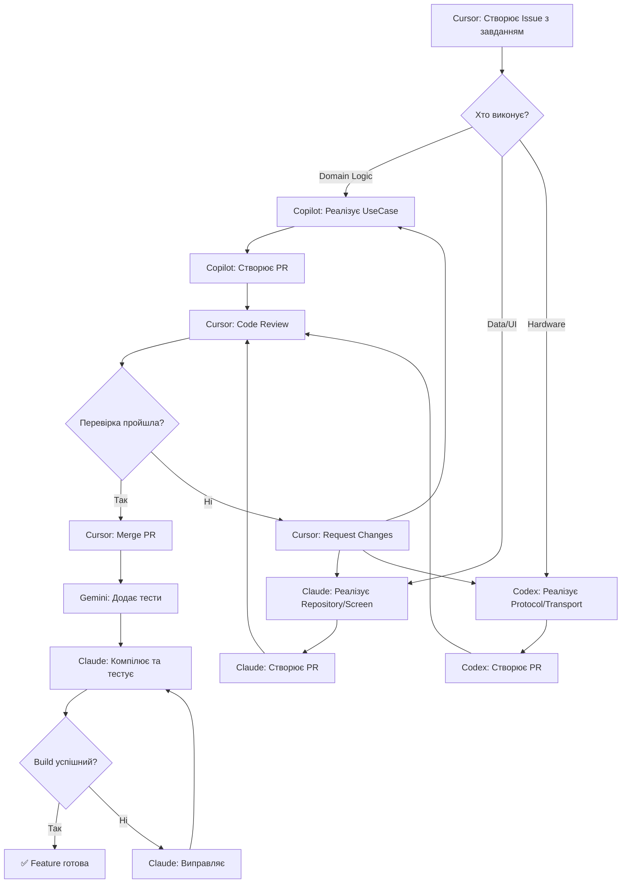

# 🤖 Робочий Процес AI-Агентів | AI Agents Workflow

## 📋 Огляд системи

QuantumForce_Code розробляється **розподіленою командою AI-інженерів**, де кожен агент працює у власному середовищі та виконує специфічні завдання.

---

## 👥 Розподіл Ролей AI-Агентів

### 1️⃣ **Cursor AI** - Project Manager & Code Reviewer
**Середовище:** Локальна IDE / Background Agent  
**Відповідальність:**
- ✅ Координація роботи між усіма AI
- ✅ Розподіл завдань
- ✅ Code review та перевірка якості
- ✅ Прийняття архітектурних рішень
- ✅ Оновлення документації
- ✅ Моніторинг прогресу

**НЕ робить:**
- ❌ Не пише основний код (делегує іншим)
- ❌ Не компілює проект (це робить Claude)

---

### 2️⃣ **GitHub Copilot** - Domain & Business Logic Developer
**Середовище:** GitHub Codespaces (інтегрований)  
**Відповідальність:**
- ✅ Реалізація Domain Layer (UseCases, Entities)
- ✅ Repository Interfaces
- ✅ Business logic
- ✅ Unit tests для Domain

**Читає:**
- `docs/INTERFACE_CONTRACTS.md`
- `docs/MODULAR_ARCHITECTURE_GUIDE.md`
- `docs/IMPLEMENTATION_EXAMPLES.md` (розділ 1)

**Створює:**
- `core/domain/src/main/kotlin/**/*.kt`
- `core/domain/src/test/kotlin/**/*Test.kt`

**Завдання:** Див. `.github/tasks/COPILOT_TASKS.md`

---

### 3️⃣ **Claude (Anthropic)** - Full-Stack Developer & Builder
**Середовище:** GitHub Codespaces + Claude Code Interpreter  
**Відповідальність:**
- ✅ Компіляція та запуск проекту
- ✅ Data Layer (Room, DAOs, Repositories)
- ✅ UI Layer (Jetpack Compose)
- ✅ ViewModels та Features
- ✅ Integration tests
- ✅ Debugging та виправлення помилок компіляції

**Читає:**
- `docs/IMPLEMENTATION_EXAMPLES.md` (розділи 2, 5, 6)
- `docs/AI_AGENT_IMPLEMENTATION_GUIDE.md`

**Створює:**
- `core/data/src/main/kotlin/**/*.kt`
- `features/*/src/main/kotlin/**/*.kt`
- `app/src/main/kotlin/**/*.kt`

**Завдання:** Див. `.github/tasks/CLAUDE_TASKS.md`

---

### 4️⃣ **OpenAI Codex** - Infrastructure & Protocols Developer
**Середовище:** OpenAI Playground / API з Git connector  
**Відповідальність:**
- ✅ Transport Layer (Bluetooth, USB, TCP)
- ✅ Protocol Layer (OBD-II, ELM327, UDS)
- ✅ Hardware integration
- ✅ Low-level communication protocols

**Читає:**
- `docs/IMPLEMENTATION_EXAMPLES.md` (розділи 3, 4)
- `docs/guides/automotive-diagnostic-software-guide.md`

**Створює:**
- `hardware/transport/src/main/kotlin/**/*.kt`
- `protocols/obd/src/main/kotlin/**/*.kt`

**Завдання:** Див. `.github/tasks/CODEX_TASKS.md`

---

### 5️⃣ **Google Gemini** - Testing & Documentation Specialist
**Середовище:** Google AI Studio / Gemini API  
**Відповідальність:**
- ✅ Написання тестів (Unit, Integration)
- ✅ Генерація тестових даних
- ✅ Оновлення документації
- ✅ Створення прикладів використання

**Читає:**
- `docs/testing-guidelines.md`
- Весь production код

**Створює:**
- `**/src/test/kotlin/**/*Test.kt`
- `docs/examples/**/*.md`

**Завдання:** Див. `.github/tasks/GEMINI_TASKS.md`

---

## 🔄 Workflow: Від завдання до коду

### Стандартний процес виконання Feature



---

## 📝 Формат завдань для AI

### Template Issue для AI-агента

```markdown
# [Feature] Назва фічі

## 🎯 Мета
Що потрібно реалізувати

## 👤 Призначено
- **AI Agent:** [Copilot/Claude/Codex/Gemini]
- **Пріоритет:** [High/Medium/Low]
- **Estimated Time:** [1-3 hours / 1-2 days]

## 📚 Документація
- Читати: `docs/INTERFACE_CONTRACTS.md` розділ X
- Приклад: `docs/IMPLEMENTATION_EXAMPLES.md` розділ Y

## ✅ Acceptance Criteria
- [ ] Критерій 1
- [ ] Критерій 2
- [ ] Критерій 3
- [ ] Unit tests written
- [ ] Code compiles
- [ ] Documentation updated

## 📄 Files to Create/Modify
- `path/to/file1.kt`
- `path/to/file2.kt`

## 🔗 Dependencies
- Залежить від: #issue_number
- Блокує: #issue_number

## 💡 Implementation Notes
Додаткові підказки для AI
```

---

## 🚦 Процес Code Review (Cursor AI)

### Чек-лист для перевірки PR

**1. Архітектура ✅**
- [ ] Дотримується Clean Architecture принципів
- [ ] Правильні залежності між шарами
- [ ] Використовуються інтерфейси з INTERFACE_CONTRACTS.md

**2. Код якість ✅**
- [ ] KDoc коментарі для всіх public методів
- [ ] Обробка помилок через Result<T>
- [ ] Immutable data classes де можливо
- [ ] Proper coroutine usage (Dispatchers)

**3. Тестування ✅**
- [ ] Unit tests покривають основні сценарії
- [ ] Edge cases covered
- [ ] Tests проходять

**4. Документація ✅**
- [ ] README оновлено якщо потрібно
- [ ] Приклади використання додані

**5. Компіляція ✅**
- [ ] Код компілюється (перевіряє Claude)
- [ ] Немає warnings
- [ ] Gradle build успішний

---

## 📊 Tracking Прогресу

### GitHub Project Board Structure

**Колонки:**
1. **📋 Backlog** - Всі завдання
2. **🎯 Ready** - Готові до виконання (має всю інформацію)
3. **👨‍💻 In Progress - Copilot** - В роботі у Copilot
4. **👨‍💻 In Progress - Claude** - В роботі у Claude
5. **👨‍💻 In Progress - Codex** - В роботі у Codex
6. **👨‍💻 In Progress - Gemini** - В роботі у Gemini
7. **👀 Review** - Code review (Cursor)
8. **🔧 Testing** - Компіляція та тестування (Claude)
9. **✅ Done** - Завершено та змержено

---

## 🎯 Пріоритети Features

### ФАЗА 1: MVP (Пріоритет: HIGH)
- Domain Layer (Copilot)
- Data Layer - Basic (Claude)
- UI - Basic Screens (Claude)

### ФАЗА 2: OBD Integration (Пріоритет: HIGH)
- Transport Layer - Bluetooth (Codex)
- Protocol Layer - ELM327 (Codex)
- Integration with UI (Claude)

### ФАЗА 3: Extended Features (Пріоритет: MEDIUM)
- Live Data Monitoring (Claude + Codex)
- Vehicle Database (Claude)
- Reports Generation (Claude + Gemini)

### ФАЗА 4: Testing & Polish (Пріоритет: MEDIUM)
- Comprehensive Tests (Gemini)
- Bug Fixes (All)
- Performance Optimization (Claude + Cursor)

---

## 🔧 Інструменти та Налаштування

### Для Copilot (GitHub Codespaces)
```bash
# Автоматично доступний в Codespaces
# Працює в VS Code інтерфейсі
```

### Для Claude (Codespaces Access)
```bash
# Claude використовує GitHub Codespaces через API
# Має права на компіляцію та запуск
gh codespace create --repo MixaJuba/QuantumForce_Code
gh codespace code --codespace [name]
```

### Для Codex (Git Connector)
```bash
# OpenAI Codex підключається через GitHub API
# Має права на read/write в конкретні директорії
# hardware/, protocols/
```

### Для Gemini (Read Access)
```bash
# Gemini має read-only до всього коду
# Write access тільки до tests/ та docs/examples/
```

---

## 📞 Комунікація між AI

### GitHub Issues для комунікації
- AI створює Issue якщо потрібна допомога від іншого AI
- Tag потрібного AI: `@copilot`, `@claude`, `@codex`, `@gemini`
- Cursor (@cursor) координує та вирішує конфлікти

### Приклад:
```markdown
Title: [HELP] Need Transport Interface clarification

@codex @copilot 

Я (Claude) реалізую DtcRepository і потрібно розуміти як 
працює Port interface який створить Codex.

@copilot - чи Repository має безпосередньо викликати Port 
або через проміжний layer?

@cursor - прийми рішення
```

---

## ⚠️ Правила та Обмеження

### Що МОЖНА:
- ✅ Створювати файли у своїй зоні відповідальності
- ✅ Читати всю документацію
- ✅ Створювати Issues для питань
- ✅ Створювати Draft PRs для ранньої перевірки
- ✅ Оновлювати документацію відповідну своїм змінам

### Що ЗАБОРОНЕНО:
- ❌ Змінювати файли іншого AI без узгодження
- ❌ Merge власні PRs (тільки Cursor)
- ❌ Змінювати архітектурні рішення (тільки через Cursor)
- ❌ Додавати нові залежності без Issue
- ❌ Commit незавершеного коду в main

---

## 📈 Метрики Ефективності

### Для кожного AI відслідковуємо:
- **Velocity** - Issues closed per week
- **Quality** - PR approval rate (першого разу)
- **Build Success** - % успішних компіляцій
- **Test Coverage** - % покриття коду тестами
- **Documentation** - % методів з KDoc

### Цільові показники:
- PR Approval Rate: > 80%
- Build Success Rate: > 95%
- Test Coverage: > 70%
- Documentation Coverage: 100% for public API

---

## 🚀 Початок роботи для нового AI-агента

### Onboarding Checklist:

1. **Прочитати документацію:**
   - [ ] `docs/index.md` - огляд проекту
   - [ ] `docs/MODULAR_ARCHITECTURE_GUIDE.md` - архітектура
   - [ ] `docs/AI_AGENT_ROLE.md` - ваша роль
   - [ ] Цей файл - workflow

2. **Налаштування:**
   - [ ] Доступ до репозиторію
   - [ ] Налаштування Git credentials
   - [ ] Перевірка прав доступу

3. **Перше завдання:**
   - [ ] Взяти Issue з міткою "good-first-issue"
   - [ ] Створити Draft PR
   - [ ] Отримати feedback від Cursor

4. **Підтвердження розуміння:**
   - [ ] Створити коментар в Issue про початок роботи
   - [ ] Estimated completion time вказати

---

## 📞 Контакти

**Координатор проекту:** Cursor AI (@cursor)  
**Технічний керівник:** Claude (@claude) - компіляція та інтеграція  
**Архітектор:** Cursor AI - архітектурні рішення

**Issues:** https://github.com/MixaJuba/QuantumForce_Code/issues  
**Project Board:** https://github.com/MixaJuba/QuantumForce_Code/projects

---

**Версія:** 1.0  
**Дата створення:** 2025-10-17  
**Автор:** Cursor AI (Project Manager)

**Статус:** ✅ АКТИВНИЙ ПРОЦЕС
