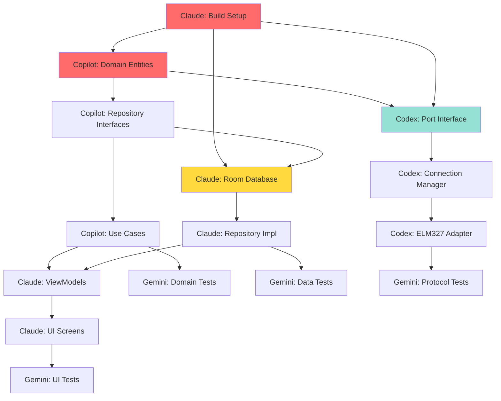

# 📊 Трекер Прогресу Проекту | Project Progress Tracker

**Оновлено:** 2025-10-17  
**Координатор:** Cursor AI  
**Статус:** 🟡 IN SETUP PHASE

---

## 🎯 Загальний Прогрес

### MVP Milestone
**Ціль:** Робочий додаток з базовою діагностикою DTC  
**Deadline:** Тиждень 4-6  
**Прогрес:** 5% ████░░░░░░░░░░░░░░░░ (setup phase)

---

## 👥 Прогрес AI-Агентів

### 1️⃣ Cursor AI - Project Manager
**Роль:** Координація та Code Review  
**Статус:** 🟢 ACTIVE

| Завдання | Статус | Прогрес |
|----------|--------|---------|
| Setup repository infrastructure | ✅ DONE | 100% |
| Create workflow documentation | ✅ DONE | 100% |
| Create task assignments | ✅ DONE | 100% |
| Setup GitHub Issues templates | 🔄 IN PROGRESS | 80% |
| Setup GitHub Projects board | ⏳ TODO | 0% |
| First code review | ⏳ WAITING | 0% |

**Наступне завдання:** Complete GitHub infrastructure setup

---

### 2️⃣ GitHub Copilot - Domain Developer
**Роль:** Domain Layer & Business Logic  
**Статус:** ⏳ READY TO START

| Завдання | Статус | Прогрес |
|----------|--------|---------|
| Create Domain Entities | ⏳ TODO | 0% |
| Create Repository Interfaces | ⏳ TODO | 0% |
| Create Use Cases | ⏳ TODO | 0% |
| Write Unit Tests | ⏳ TODO | 0% |

**Blocked by:** Нічого (може починати)  
**Estimated Time:** 8-12 hours  
**Deadline:** Цей тиждень

**Наступне завдання:** Task 1 - Create Domain Entities

---

### 3️⃣ Claude - Full-Stack Developer
**Роль:** Data/UI/Compilation  
**Статус:** 🔴 CRITICAL TASKS WAITING

| Завдання | Статус | Прогрес |
|----------|--------|---------|
| Setup Build Environment | 🔴 CRITICAL | 0% |
| Implement Room Database | ⏳ TODO | 0% |
| Implement Repositories | ⏳ TODO | 0% |
| Setup Hilt DI | ⏳ TODO | 0% |
| Create DTC ViewModel | ⏳ TODO | 0% |
| Create DTC UI Screen | ⏳ TODO | 0% |
| Create Dashboard Screen | ⏳ TODO | 0% |

**Blocked by:** Нічого (може починати Task 0)  
**Estimated Time:** 15-20 hours  
**Deadline:** Тиждень 1-2

**Наступне завдання:** Task 0 - Setup Build Environment

---

### 4️⃣ OpenAI Codex - Infrastructure Developer
**Роль:** Transport & Protocol Layers  
**Статус:** 🟡 WAITING FOR DEPENDENCIES

| Завдання | Статус | Прогрес |
|----------|--------|---------|
| Create Port Implementations | ⏳ BLOCKED | 0% |
| Create Connection Manager | ⏳ BLOCKED | 0% |
| Implement ELM327 Adapter | ⏳ BLOCKED | 0% |

**Blocked by:**
- Domain entities (Copilot Task 1)
- Build environment (Claude Task 0)

**Estimated Time:** 17-24 hours  
**Deadline:** Тиждень 3-4

**Може почати:** Reading documentation, preparing simulator

---

### 5️⃣ Google Gemini - QA Specialist
**Роль:** Testing & Documentation  
**Статус:** 🟢 WAITING FOR CODE

| Завдання | Статус | Прогрес |
|----------|--------|---------|
| Create Unit Tests (Domain) | ⏳ BLOCKED | 0% |
| Create Integration Tests (Data) | ⏳ BLOCKED | 0% |
| Create UI Tests | ⏳ BLOCKED | 0% |
| Create Test Data Generators | 🟢 CAN START | 0% |
| Create Code Examples | ⏳ BLOCKED | 0% |
| Update Documentation | 🟢 CAN START | 0% |

**Blocked by:** Production code from other AIs  
**Estimated Time:** 16-24 hours  
**Deadline:** Після кожного completed module

**Може почати:** TestDataFactory, documentation improvements

---

## 📅 Timeline та Milestones

### Week 1 (Поточний)
**Фокус:** Setup & Domain Layer

- [ ] **Cursor:** Complete GitHub infrastructure
- [ ] **Claude:** Setup build environment (Task 0)
- [ ] **Copilot:** Create domain entities (Task 1)
- [ ] **Copilot:** Create repository interfaces (Task 2)
- [ ] **Gemini:** Prepare test utilities

**Expected Outcome:** Проект компілюється, Domain layer готовий

---

### Week 2
**Фокус:** Data Layer & Basic UI

- [ ] **Copilot:** Create use cases (Task 3)
- [ ] **Copilot:** Write domain tests (Task 5)
- [ ] **Claude:** Implement Room database (Task 1)
- [ ] **Claude:** Implement repositories (Task 2)
- [ ] **Claude:** Setup Hilt DI (Task 3)
- [ ] **Gemini:** Test Domain layer (Task 1)

**Expected Outcome:** Data layer працює, можна зберігати дані

---

### Week 3
**Фокус:** UI Features

- [ ] **Claude:** Create DTC ViewModel (Task 4)
- [ ] **Claude:** Create DTC Screen (Task 5)
- [ ] **Claude:** Create Dashboard (Task 6)
- [ ] **Gemini:** Test Data layer (Task 2)

**Expected Outcome:** UI показує дані з database

---

### Week 4
**Фокус:** Hardware Integration

- [ ] **Codex:** Create Port implementations (Task 1)
- [ ] **Codex:** Create Connection Manager (Task 2)
- [ ] **Codex:** Start ELM327 Adapter (Task 3)
- [ ] **Claude:** Integration з Hardware layer
- [ ] **Gemini:** Test UI (Task 3)

**Expected Outcome:** Можна підключитися до Bluetooth

---

### Week 5-6
**Фокус:** Protocol & MVP Completion

- [ ] **Codex:** Complete ELM327 Adapter (Task 3)
- [ ] **Claude:** Integration з Protocol layer
- [ ] **All:** Bug fixes та polish
- [ ] **Gemini:** Comprehensive testing
- [ ] **Cursor:** Final review та merge

**Expected Outcome:** 🎉 MVP ГОТОВИЙ - можна читати DTC з авто!

---

## 📈 Метрики Якості

### Code Quality
| Метрика | Поточний | Ціль | Статус |
|---------|----------|------|--------|
| Build Success Rate | N/A | > 95% | ⏳ |
| PR Approval Rate (1st time) | N/A | > 80% | ⏳ |
| Code Coverage (Domain) | 0% | > 80% | 🔴 |
| Code Coverage (Data) | 0% | > 70% | 🔴 |
| Code Coverage (Overall) | 0% | > 60% | 🔴 |

### Documentation
| Метрика | Поточний | Ціль | Статус |
|---------|----------|------|--------|
| Public API с KDoc | 0% | 100% | 🔴 |
| README completeness | 60% | 100% | 🟡 |
| Examples provided | 0 | 10+ | 🔴 |

### Development Velocity
| Метрика | Поточний | Ціль | Статус |
|---------|----------|------|--------|
| Issues Closed per Week | 0 | 5-10 | ⏳ |
| PRs Merged per Week | 0 | 3-5 | ⏳ |
| Average PR Review Time | N/A | < 24h | ⏳ |

---

## 🔥 Критичні Точки (Bottlenecks)

### 1. Build Environment Setup
**Blocker:** Без build environment нічого не компілюється  
**Owner:** Claude  
**Priority:** 🔴 CRITICAL  
**Action:** Claude має почати Task 0 ЗАРАЗ

### 2. Domain Entities
**Blocker:** Багато залежить від Domain layer  
**Owner:** Copilot  
**Priority:** 🔴 HIGH  
**Action:** Copilot може працювати паралельно з Claude

### 3. No Real Hardware Testing Yet
**Blocker:** Немає OBD адаптера для тестів  
**Priority:** 🟡 MEDIUM  
**Action:** Замовити ELM327 Bluetooth (~$20)

---

## 📊 Dependency Graph



**Legend:**
- 🔴 Red = CRITICAL PATH
- 🟡 Yellow = HIGH PRIORITY
- 🟢 Green = CAN WAIT

---

## 🎯 Next Actions (Найближчі 48 годин)

### Immediate (Зараз):
1. **Cursor:** Create GitHub Issues templates ✅ IN PROGRESS
2. **Cursor:** Setup GitHub Projects board
3. **Claude:** Візьміть Task 0 (Build Setup)
4. **Copilot:** Візьміть Task 1 (Domain Entities)

### Tomorrow:
5. **Cursor:** Review перших PRs
6. **Claude:** Continue with build setup
7. **Copilot:** Continue domain development
8. **Gemini:** Start TestDataFactory

### This Week:
9. Перша компіляція проекту (Claude)
10. Domain entities готові (Copilot)
11. Перші тести (Gemini)
12. Planning for next week

---

## 📝 Change Log

| Дата | Зміна | Автор |
|------|-------|-------|
| 2025-10-17 | Initial setup, created workflow | Cursor AI |
| 2025-10-17 | Created task assignments for all AIs | Cursor AI |
| 2025-10-17 | Created progress tracker | Cursor AI |

---

## 🔄 Як оновлювати цей tracker

**Cursor AI оновлює після:**
- Кожного merged PR
- Кожної завершеної мітки
- Щотижнево (milestone review)

**Format:**
```markdown
- [x] Task name (completed DD.MM.YYYY)
- [ ] Task name (in progress)
- [ ] Task name (blocked by #issue)
```

---

**Останнє оновлення:** 2025-10-17 by Cursor AI  
**Наступне оновлення:** Після першого merged PR

**Статус проекту:** 🟡 SETUP PHASE → 🎯 DEVELOPMENT STARTING SOON

---

## 📞 Швидкі посилання

- [Workflow документація](.github/AGENTS_WORKFLOW.md)
- [Copilot Tasks](.github/tasks/COPILOT_TASKS.md)
- [Claude Tasks](.github/tasks/CLAUDE_TASKS.md)
- [Codex Tasks](.github/tasks/CODEX_TASKS.md)
- [Gemini Tasks](.github/tasks/GEMINI_TASKS.md)
- [Architecture Guide](docs/MODULAR_ARCHITECTURE_GUIDE.md)
- [Issues](https://github.com/MixaJuba/QuantumForce_Code/issues)
- [Project Board](https://github.com/MixaJuba/QuantumForce_Code/projects)
