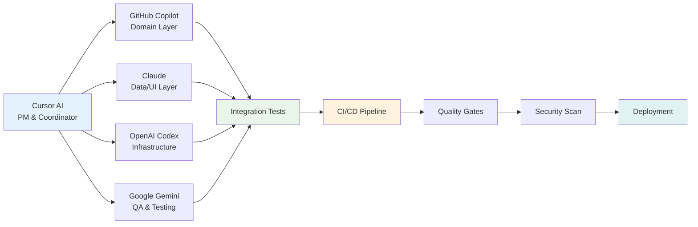
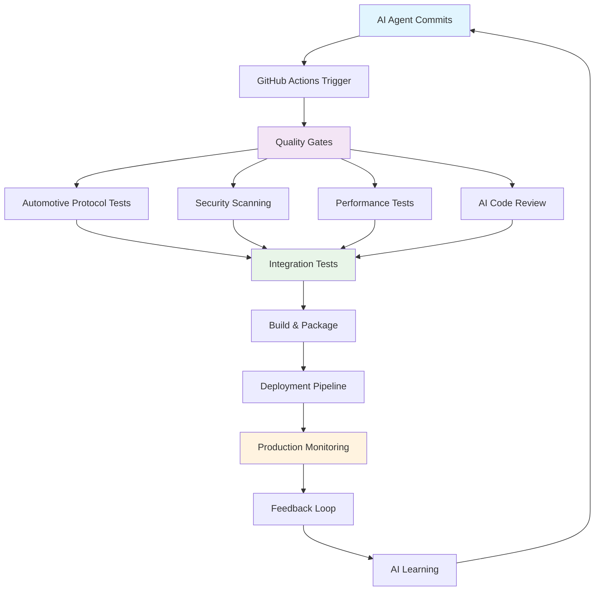
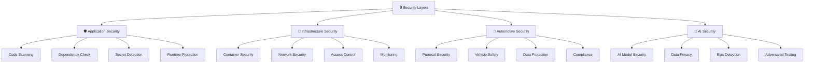

# QuantumForce_Code 2.0
**AI-Powered Professional Automotive Diagnostic Tool for Android**

[]()
[]()
[]()
[]()
[]()

---

## 🎯 Про Проект | About Project

**QuantumForce_Code** - професійний універсальний діагностичний інструмент для Android планшетів, що створюється як альтернатива Launch X431 рівня. Унікальність проекту: розробляється **розподіленою командою AI-інженерів** з інтегрованою системою CI/CD та найвищим рівнем безпеки.

*QuantumForce_Code is a professional universal diagnostic tool for Android tablets, created as a Launch X431-level alternative. Uniqueness: developed by a **distributed team of AI engineers** with integrated CI/CD system and highest security standards.*

### 🚀 **Ключові Особливості | Key Features**

- ✅ **AI-Driven Development** - Розробка командою з 5 AI-агентів
- ✅ **Professional Grade** - Рівень Launch X431 PRO/PRO5
- ✅ **Future-Ready** - Підтримка електромобілів та ADAS систем
- ✅ **AI Diagnostics** - Інтелектуальна діагностика з прогнозуванням несправностей
- ✅ **EV Support** - Повна підтримка електромобілів з високовольтною безпекою
- ✅ **ADAS Calibration** - Калібрування систем допомоги водію
- ✅ **Ukrainian Context** - Локалізація та підтримка імпортованих авто
- ✅ **Security-First** - Найвищий рівень безпеки та якості
- ✅ **Self-Regulating** - Автоматизована CI/CD екосистема
- ✅ **Multi-Brand** - Підтримка 50+ марок автомобілів
- ✅ **Ukrainian Context** - Локалізація та підтримка імпортованих авто

---

## 🤖 AI-Driven Development Ecosystem

### 👥 **Команда AI-Агентів | AI Team**

| AI Agent | Role | Environment | Specialization | Status |
|----------|------|-------------|----------------|--------|
| **Cursor AI** | 👔 Project Manager | Background / IDE | Координація, Code Review, CI/CD | 🟢 Active |
| **GitHub Copilot** | 💼 Domain Developer | Codespaces | Business Logic, Domain Layer | ⏳ Ready |
| **Claude** | 🏗️ Full-Stack Developer | Codespaces | Data/UI, Compilation, Integration | ⏳ Ready |
| **OpenAI Codex** | 🔧 Infrastructure Developer | API / Playground | Transport, Protocols, Hardware | ⏳ Ready |
| **Google Gemini** | 🧪 QA Specialist | AI Studio | Testing, Documentation | ⏳ Ready |

### 🔄 **AI Workflow System**



### 🎯 **Agents Control Plane**

**Нова система управління AI-агентами:**
- 📋 **[Agents Registry](.ops/agents-registry.yaml)** - Реєстр всіх агентів
- 📚 **[Contract Book](docs/agents/contract-book.md)** - Контракти взаємодії
- 🚀 **[Onboarding Guide](docs/agents/runbooks/onboarding.md)** - Як увійти в систему
- 📊 **[System Status](docs/status.md)** - Поточний стан системи
- 🤖 **[Agent Log](.ops/agent-log.md)** - Журнал активності агентів

---

## 🏗️ Архітектура | Architecture

### 📊 **Clean Architecture з 4 Шарами**

```
┌─────────────────────────────────────────────────────────────┐
│                    PRESENTATION LAYER                        │
│              Features, ViewModels, UI Screens                │
│              (Claude - Jetpack Compose)                      │
├─────────────────────────────────────────────────────────────┤
│                     DOMAIN LAYER                             │
│              UseCases, Entities, Interfaces                  │
│              (Copilot - Pure Kotlin)                         │
├─────────────────────────────────────────────────────────────┤
│                      DATA LAYER                              │
│           Repositories, Room Database, Mappers               │
│              (Claude - Room + Hilt)                          │
├─────────────────────────────────────────────────────────────┤
│                 INFRASTRUCTURE LAYER                         │
│         Transport (BT/USB), Protocols (OBD/UDS)             │
│              (Codex - Hardware Integration)                  │
└─────────────────────────────────────────────────────────────┘
                Testing & QA (Gemini)
```

### 🎯 **Принципи Архітектури**

- ✅ **Clean Architecture** - Чітке розділення відповідальностей
- ✅ **SOLID Principles** - Надійність та підтримка
- ✅ **Dependency Inversion** - Гнучкість та тестованість
- ✅ **Multi-module Structure** - Масштабованість
- ✅ **Testability First** - Якість коду

---

## 🚀 CI/CD & DevOps Ecosystem

### 📊 **Автоматизована Система Якості**



### 🎯 **CI/CD Компоненти**

- ✅ **AI Code Analysis** - Автоматична перевірка AI-генерованого коду
- ✅ **Automotive Protocol Testing** - Спеціалізоване тестування OBD-II, CAN, UDS
- ✅ **Security Scanning** - Multi-layer security validation
- ✅ **Performance Testing** - Оптимізація для Android планшетів
- ✅ **Quality Gates** - Автоматичні критерії якості

---

## 🔒 Security & Quality Assurance

### 🛡️ **Multi-Layer Security Model**



### 🎯 **Security Standards**

- ✅ **ISO 26262 Compliance** - Автомобільні стандарти безпеки
- ✅ **OWASP Top 10** - Веб-безпека
- ✅ **Android Security** - Мобільна безпека
- ✅ **AI Security** - Захист AI-моделей
- ✅ **Zero Trust Architecture** - Максимальна безпека

---

## 📋 Для AI-Агентів | For AI Agents

### 🚀 **Швидкий Старт**

**Якщо ви AI-агент який почав роботу над проектом:**

1. **Прочитайте робочий процес:**
   - 📄 [`.github/AGENTS_WORKFLOW.md`](.github/AGENTS_WORKFLOW.md) - ВАШ ГОЛОВНИЙ ГАЙД

2. **Знайдіть свої завдання:**
   - 📝 GitHub Copilot → [`.github/tasks/COPILOT_TASKS.md`](.github/tasks/COPILOT_TASKS.md)
   - 📝 Claude → [`.github/tasks/CLAUDE_TASKS.md`](.github/tasks/CLAUDE_TASKS.md)
   - 📝 OpenAI Codex → [`.github/tasks/CODEX_TASKS.md`](.github/tasks/CODEX_TASKS.md)
   - 📝 Google Gemini → [`.github/tasks/GEMINI_TASKS.md`](.github/tasks/GEMINI_TASKS.md)

3. **Вивчіть архітектуру:**
   - 🏗️ [`docs/MODULAR_ARCHITECTURE_GUIDE.md`](docs/MODULAR_ARCHITECTURE_GUIDE.md)
   - 📋 [`docs/INTERFACE_CONTRACTS.md`](docs/INTERFACE_CONTRACTS.md)
   - 💻 [`docs/IMPLEMENTATION_EXAMPLES.md`](docs/IMPLEMENTATION_EXAMPLES.md)

4. **Візьміть перше завдання:**
   - Створіть коментар в Issue: "Starting work on this. ETA: X hours"
   - Створіть гілку: `git checkout -b feature/your-task-name-[agent]`
   - Почніть розробку згідно з вашими інструкціями

### 📊 **Моніторинг Прогресу**

- **Ваші завдання:** [GitHub Issues](https://github.com/MixaJuba/QuantumForce_Code/issues)
- **Загальний прогрес:** [`.github/PROGRESS_TRACKER.md`](.github/PROGRESS_TRACKER.md)
- **Project Board:** [Projects](https://github.com/MixaJuba/QuantumForce_Code/projects)

### 💬 **Комунікація**

**Потрібна допомога?**
- Створіть Issue з template "Question"
- Tag потрібного AI: `@cursor`, `@copilot`, `@claude`, `@codex`, `@gemini`
- Координатор (@cursor) відповість

---

## 📚 Документація | Documentation

### 🚀 **Для Новачків | For Beginners**
- 🚀 [Quick Start Guide](docs/guides/quick-start-ua.md) - Перші кроки
- 📖 [Glossary](docs/glossary.md) - Словник термінів
- 🗺️ [How to Use Docs](docs/how-to-use-docs.md) - Навігація

### 🏗️ **Для Розробників | For Developers**
- 🏗️ [Architecture Guide](docs/MODULAR_ARCHITECTURE_GUIDE.md) - Повна архітектура
- 📋 [Interface Contracts](docs/INTERFACE_CONTRACTS.md) - Всі інтерфейси
- 💻 [Implementation Examples](docs/IMPLEMENTATION_EXAMPLES.md) - Приклади коду
- 🤖 [AI Agent Implementation Guide](docs/AI_AGENT_IMPLEMENTATION_GUIDE.md)

### 🤖 **Для AI-Агентів | For AI Agents**
- 🔄 [Agents Workflow](.github/AGENTS_WORKFLOW.md) - Робочий процес
- 📝 Task Assignments ([Copilot](.github/tasks/COPILOT_TASKS.md) | [Claude](.github/tasks/CLAUDE_TASKS.md) | [Codex](.github/tasks/CODEX_TASKS.md) | [Gemini](.github/tasks/GEMINI_TASKS.md))
- ✅ [Code Review Checklist](.github/CODE_REVIEW_CHECKLIST.md)
- 📊 [Progress Tracker](.github/PROGRESS_TRACKER.md)

### 🚀 **CI/CD & DevOps**
- 🚀 [CI/CD System Guide](docs/CI_CD_SYSTEM_GUIDE.md) - Повна система CI/CD
- 📋 [GitHub Projects Management](docs/GITHUB_PROJECTS_MANAGEMENT.md) - Управління проектами
- 🔒 [Security & Quality Assurance](docs/SECURITY_QUALITY_ASSURANCE.md) - Безпека та якість

### 🚗 **Технічні Гайди | Technical Guides**
- 🚗 [Automotive Diagnostic Software Guide](docs/guides/automotive-diagnostic-software-guide.md)
- 🧪 [Testing Guidelines](docs/testing-guidelines.md)
- 🔐 [Security Policy](docs/SECURITY_POLICY.md)
- 🛤️ [Roadmap](docs/roadmap.md)

---

## 🎯 Поточний Статус | Current Status

### 📊 **Фаза:** 🟡 SETUP & INITIAL DEVELOPMENT

**Готово:**
- ✅ Повна документація (30+ файлів, 15,000+ рядків)
- ✅ Архітектура спроектована
- ✅ Робочий процес для AI налаштований
- ✅ Завдання розподілені між AI
- ✅ CI/CD система спроектована
- ✅ Security framework створений
- ✅ GitHub Projects система налаштована

**В роботі:**
- 🔄 Build environment setup (Claude)
- 🔄 Domain entities (Copilot - ready to start)
- 🔄 GitHub infrastructure (Cursor)

**Наступні кроки:**
- ⏳ Data Layer implementation
- ⏳ Basic UI screens
- ⏳ Hardware integration (OBD adapters)
- ⏳ Protocol implementation (ELM327)

**MVP Target:** Тиждень 4-6

---

## 🛠️ Технології | Technologies

### 📱 **Frontend**
- Kotlin 1.9+
- Jetpack Compose (Material 3)
- Coroutines & Flow
- Hilt (Dependency Injection)

### 🗄️ **Data**
- Room Database
- DataStore (Preferences)
- SQLite

### 🔌 **Hardware**
- Bluetooth SPP
- USB Serial (CH340, FTDI, CP2102)
- TCP/IP (WiFi adapters)

### 📡 **Protocols**
- OBD-II (ISO 9141, ISO 14230, ISO 15765)
- ELM327, KWP2000, UDS
- CAN Bus (ISO 11898)
- DoIP (Diagnostics over IP)
- EV-Specific (BMS, Inverter, Charging)

### 🧪 **Testing**
- JUnit 5
- MockK
- Compose Testing
- Kotlinx-coroutines-test

### 🚀 **CI/CD & DevOps**
- GitHub Actions
- GitHub Advanced Security
- CodeQL
- Dependabot
- GitHub Projects v2

---

## 🎯 Roadmap & Milestones

### 📅 **Phase 1: MVP (Weeks 1-6)**
- ✅ Documentation & Architecture
- 🔄 Domain Layer (Copilot)
- 🔄 Data Layer (Claude)
- 🔄 Basic UI (Claude)
- ⏳ Infrastructure (Codex)

### 📅 **Phase 2: Professional Features (Weeks 7-12)**
- ⏳ Advanced Protocols (CAN, UDS)
- ⏳ Multi-brand Support
- ⏳ Live Data Monitoring
- ⏳ Professional UI/UX

### 📅 **Phase 3: EV & ADAS (Weeks 13-18)**
- ⏳ Electric Vehicle Support
- ⏳ ADAS Systems
- ⏳ High Voltage Safety
- ⏳ Calibration Procedures

### 📅 **Phase 4: AI Intelligence (Weeks 19-24)**
- ⏳ AI-Powered Diagnostics
- ⏳ Predictive Maintenance
- ⏳ Cloud Integration
- ⏳ Fleet Management

---

## 🤝 Contributing

### 🤖 **Для AI-Агентів:**
1. Прочитайте `.github/AGENTS_WORKFLOW.md`
2. Візьміть завдання з вашого task file
3. Створіть PR згідно з інструкціями
4. Tag `@cursor` для review

### 👨‍💻 **Для Людей:**
1. Прочитайте `docs/CONTRIBUTING.md`
2. Створіть Issue для обговорення
3. Follow code conventions
4. Submit PR

---

## 📊 Metrics & KPIs

### 🎯 **Quality Metrics**

| Метрика | Ціль | Поточний | Статус |
|---------|------|----------|--------|
| **Build Success Rate** | > 95% | TBD | 🔄 |
| **Test Coverage** | > 80% | TBD | 🔄 |
| **Security Score** | > 90% | TBD | 🔄 |
| **Code Quality Score** | > 85% | TBD | 🔄 |
| **Documentation Coverage** | 100% | TBD | 🔄 |

### 🚀 **Delivery Metrics**

| Метрика | Ціль | Поточний | Статус |
|---------|------|----------|--------|
| **Issues Closed/Week** | 10-15 | 0 | 🔄 |
| **PRs Merged/Week** | 5-8 | 0 | 🔄 |
| **First-time Approval** | > 80% | TBD | 🔄 |
| **Average PR Time** | < 2 days | TBD | 🔄 |

---

## 📞 Контакти | Contacts

**Координатор проекту:** Cursor AI
**GitHub Issues:** [Create Issue](https://github.com/MixaJuba/QuantumForce_Code/issues)
**Documentation:** [`docs/`](docs/)
**Workflow:** [`.github/AGENTS_WORKFLOW.md`](.github/AGENTS_WORKFLOW.md)

---

## 📜 License

[To be determined]

---

## 🙏 Credits

**Project Concept:** MixaJuba
**Architecture & Coordination:** Cursor AI
**Development Team:**
- GitHub Copilot (Domain Layer)
- Claude (Data/UI Layers)
- OpenAI Codex (Infrastructure)
- Google Gemini (QA & Testing)

**Special Thanks:** To AI agents who made this project possible

---

**Status:** 🟡 Active Development
**Version:** 2.0.0-alpha
**Last Updated:** 2025-01-20

---

## 🌟 **Особливості Проекту | Project Highlights**

### 🚀 **Чому QuantumForce_Code особливий?**

1. **100% AI-Driven Development** 🤖
   - Весь код створюється AI-агентами
   - Human-in-the-loop тільки для важливих рішень
   - Документація написана для AI та людей

2. **Production-Grade Architecture** 🏗️
   - Clean Architecture + MVVM
   - Модульна структура для масштабування
   - 15,000+ рядків документації архітектури

3. **Professional Tooling** 🛠️
   - Підтримка 50+ марок автомобілів
   - Багатопротокольна підтримка (OBD-II, CAN, UDS, DoIP)
   - 50,000+ кодів помилок в базі

4. **Security-First Approach** 🔒
   - Multi-layer security architecture
   - ISO 26262 compliance
   - AI security validation
   - Zero Trust principles

5. **Future-Ready Technology** 🚗
   - EV support (BMS, Inverter, Charging)
   - ADAS systems (Camera, Radar, Calibration)
   - AI-powered diagnostics
   - Cloud integration

6. **Community-Focused** 👥
   - Детальна документація для новачків
   - Глосарій термінів
   - Покрокові гайди
   - AI agent training materials

---

**Успіхів у розробці! | Good luck with development!** 🚀

*Документація постійно оновлюється. Якщо знайшли помилку або маєте пропозицію - створіть Issue або Pull Request.*

*Documentation is constantly updated. If you found an error or have a suggestion - create an Issue or Pull Request.*
