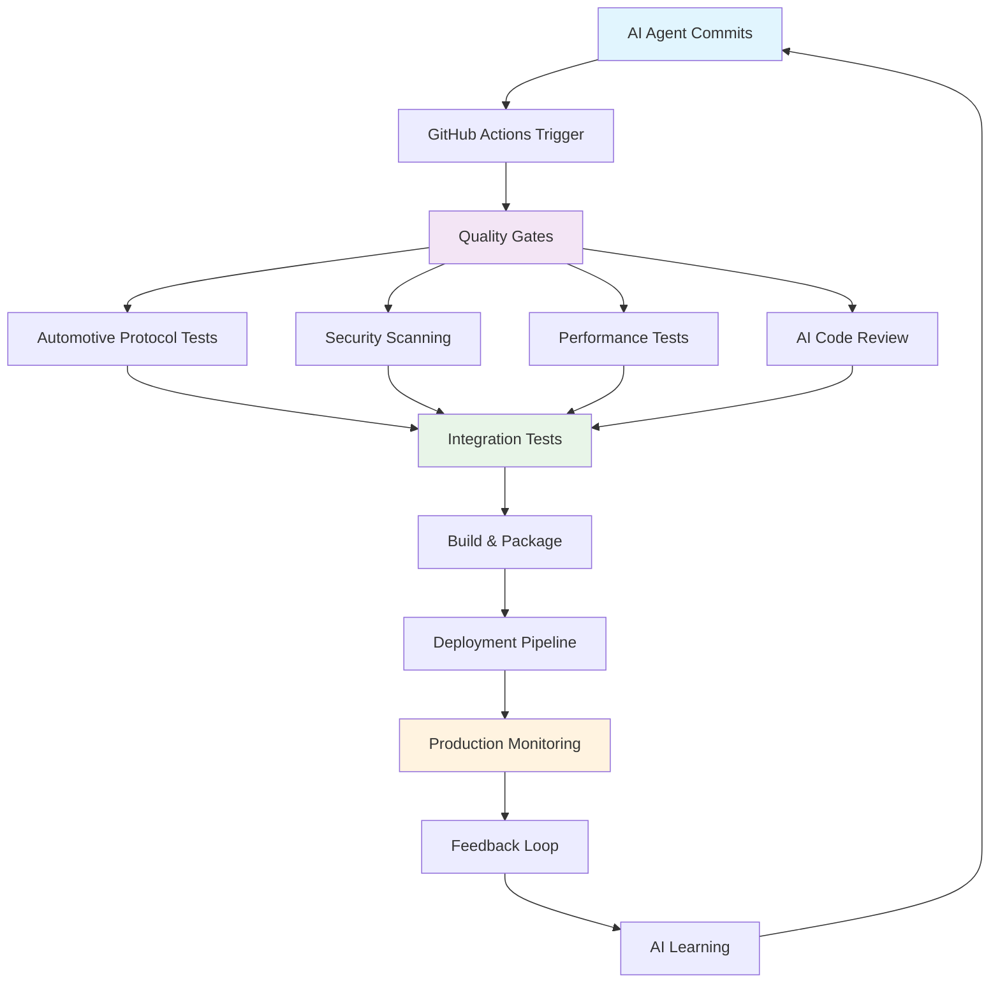
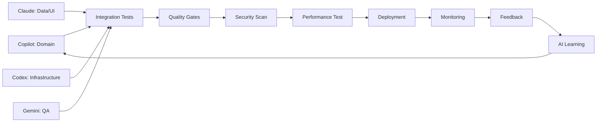

# 🚀 Система CI/CD для QuantumForce_Code 2.0
**AI-Driven Continuous Integration & Deployment Guide**

[]()
[]()
[]()

---

## 🎯 Місія CI/CD Системи

**Створити саморегульовану екосистему якості**, де кожен код від 5 AI-агентів проходить автоматичну перевірку, тестування та інтеграцію з дотриманням найвищих стандартів автомобільної діагностики.

### 🎭 Ключові Принципи

- ✅ **AI-First Quality Gates** - автоматична перевірка якості AI-генерованого коду
- ✅ **Automotive Protocol Validation** - спеціалізоване тестування для OBD-II, CAN, UDS
- ✅ **Multi-Agent Coordination** - синхронізація роботи 5 AI-агентів
- ✅ **Security-First Approach** - захист від вразливостей в критичних системах
- ✅ **Performance Excellence** - оптимізація для Android планшетів
- ✅ **Future-Ready Architecture** - підтримка електромобілів та ADAS
- ✅ **AI Code Validation** - спеціалізовані тести для AI-генерованого коду
- ✅ **EV Safety Testing** - обов'язкові перевірки високовольтних операцій
- ✅ **ADAS Calibration Validation** - тестування калібрувальних процесів

---

## 🏗️ Архітектура CI/CD Системи

### 📊 Загальна Схема



### 🎯 Компоненти Системи

#### 1. **Quality Gates Layer** 🛡️
- **AI Code Analysis** - перевірка якості AI-генерованого коду
- **Architecture Compliance** - дотримання Clean Architecture принципів
- **Code Style Enforcement** - Kotlin coding standards
- **Documentation Coverage** - KDoc та README перевірки

#### 2. **Automotive Protocol Testing** 🚗
- **OBD-II Protocol Validation** - ISO 9141, ISO 14230, ISO 15765
- **CAN Bus Testing** - ISO 11898 compliance
- **UDS Protocol Tests** - ISO 14229 validation
- **DoIP Integration** - Diagnostics over IP testing
- **EV-Specific Protocols** - BMS, Inverter, 400V/800V systems
- **ADAS Testing** - Camera, Radar, Calibration protocols

#### 3. **Security & Performance** 🔒
- **Dependency Scanning** - CVE vulnerability detection
- **Secret Detection** - API keys, credentials protection
- **Performance Benchmarks** - <2s scan time validation
- **Memory Optimization** - Android tablet constraints
- **Battery Efficiency** - Power consumption monitoring

#### 4. **Multi-Agent Coordination** 🤖
- **Agent-Specific Workflows** - спеціалізовані pipelines для кожного AI
- **Cross-Agent Dependencies** - синхронізація між агентами
- **Conflict Resolution** - автоматичне вирішення конфліктів
- **Progress Tracking** - моніторинг прогресу всієї команди

---

## 🔄 GitHub Actions Workflows

### 📋 Workflow Структура

```yaml
# .github/workflows/
├── ci-main.yml                 # Основна CI pipeline
├── ci-agent-specific/          # Агент-специфічні workflows
│   ├── copilot-domain.yml      # Domain layer testing
│   ├── claude-data-ui.yml      # Data/UI layer testing
│   ├── codex-infrastructure.yml # Infrastructure testing
│   └── gemini-testing.yml      # QA & Testing workflows
├── cd-deployment.yml           # Deployment pipeline
├── security-scanning.yml       # Security checks
├── performance-testing.yml     # Performance benchmarks
└── automotive-protocols.yml     # Protocol validation
```

### 🎯 Основна CI Pipeline

```yaml
# .github/workflows/ci-main.yml
name: 🚀 QuantumForce CI/CD Pipeline

on:
  push:
    branches: [ main, develop ]
  pull_request:
    branches: [ main, develop ]
  workflow_dispatch:

env:
  KOTLIN_VERSION: '1.9.20'
  ANDROID_COMPILE_SDK: 34
  ANDROID_TARGET_SDK: 34
  ANDROID_MIN_SDK: 24

jobs:
  # Job 1: AI Code Quality Analysis
  ai-quality-gates:
    runs-on: ubuntu-latest
    steps:
      - name: 🤖 AI Code Analysis
        uses: ./.github/actions/ai-code-analysis
        with:
          agent-type: ${{ github.actor }}
          code-quality-threshold: 85

  # Job 2: Automotive Protocol Testing
  automotive-protocols:
    runs-on: ubuntu-latest
    strategy:
      matrix:
        protocol: [OBD-II, CAN, UDS, DoIP, EV-BMS]
    steps:
      - name: 🚗 Protocol Validation
        uses: ./.github/actions/protocol-testing
        with:
          protocol: ${{ matrix.protocol }}

  # Job 3: Security Scanning
  security-scanning:
    runs-on: ubuntu-latest
    steps:
      - name: 🔒 Security Scan
        uses: ./.github/actions/security-scan
        with:
          scan-level: automotive-critical

  # Job 4: Performance Testing
  performance-testing:
    runs-on: ubuntu-latest
    steps:
      - name: ⚡ Performance Benchmarks
        uses: ./.github/actions/performance-test
        with:
          target-device: android-tablet
          max-scan-time: 2s

  # Job 5: Integration Testing
  integration-testing:
    needs: [ai-quality-gates, automotive-protocols, security-scanning]
    runs-on: ubuntu-latest
    steps:
      - name: 🔗 Integration Tests
        uses: ./.github/actions/integration-test
        with:
          test-scope: full-system
```

---

## 🤖 AI-Agent Specific Workflows

### 💼 GitHub Copilot (Domain Layer)

```yaml
# .github/workflows/ci-agent-specific/copilot-domain.yml
name: 🧠 Copilot Domain Layer CI

on:
  push:
    paths: ['core/domain/**']
  pull_request:
    paths: ['core/domain/**']

jobs:
  domain-quality:
    runs-on: ubuntu-latest
    steps:
      - name: 📋 Domain Logic Validation
        run: |
          # Перевірка бізнес-логіки
          ./scripts/validate-domain-logic.sh

      - name: 🧪 Domain Unit Tests
        run: |
          ./gradlew :core:domain:test

      - name: 📚 Documentation Coverage
        run: |
          ./scripts/check-documentation-coverage.sh core/domain

      - name: 🏗️ Architecture Compliance
        run: |
          ./scripts/check-clean-architecture.sh core/domain
```

### 🏗️ Claude (Data/UI Layer)

```yaml
# .github/workflows/ci-agent-specific/claude-data-ui.yml
name: 🎨 Claude Data/UI Layer CI

on:
  push:
    paths: ['core/data/**', 'features/**', 'app/**']
  pull_request:
    paths: ['core/data/**', 'features/**', 'app/**']

jobs:
  data-layer-testing:
    runs-on: ubuntu-latest
    services:
      postgres:
        image: postgres:15
        env:
          POSTGRES_PASSWORD: postgres
        options: >-
          --health-cmd pg_isready
          --health-interval 10s
          --health-timeout 5s
          --health-retries 5
    steps:
      - name: 🗄️ Database Testing
        run: |
          ./gradlew :core:data:test

      - name: 🔄 Room Migration Tests
        run: |
          ./scripts/test-room-migrations.sh

  ui-layer-testing:
    runs-on: ubuntu-latest
    steps:
      - name: 🎨 Compose UI Tests
        run: |
          ./gradlew :app:connectedAndroidTest

      - name: 📱 UI Screenshot Tests
        run: |
          ./scripts/ui-screenshot-tests.sh

      - name: ♿ Accessibility Tests
        run: |
          ./scripts/accessibility-tests.sh
```

### 🔧 OpenAI Codex (Infrastructure)

```yaml
# .github/workflows/ci-agent-specific/codex-infrastructure.yml
name: ⚙️ Codex Infrastructure CI

on:
  push:
    paths: ['hardware/**', 'protocols/**']
  pull_request:
    paths: ['hardware/**', 'protocols/**']

jobs:
  protocol-testing:
    runs-on: ubuntu-latest
    strategy:
      matrix:
        protocol: [ELM327, KWP2000, UDS, DoIP]
    steps:
      - name: 📡 Protocol Implementation Tests
        run: |
          ./scripts/test-protocol.sh ${{ matrix.protocol }}

      - name: 🔌 Hardware Integration Tests
        run: |
          ./scripts/test-hardware-integration.sh

      - name: 📊 Performance Benchmarks
        run: |
          ./scripts/protocol-performance-test.sh ${{ matrix.protocol }}
```

### 🧪 Google Gemini (QA & Testing)

```yaml
# .github/workflows/ci-agent-specific/gemini-testing.yml
name: 🧪 Gemini QA & Testing CI

on:
  push:
    paths: ['**/*Test.kt', '**/test/**']
  pull_request:
    paths: ['**/*Test.kt', '**/test/**']

jobs:
  comprehensive-testing:
    runs-on: ubuntu-latest
    steps:
      - name: 🧪 Unit Test Coverage
        run: |
          ./gradlew testDebugUnitTestCoverage

      - name: 🔗 Integration Test Suite
        run: |
          ./gradlew connectedAndroidTest

      - name: 📊 Test Quality Analysis
        run: |
          ./scripts/analyze-test-quality.sh

      - name: 📈 Coverage Reporting
        uses: codecov/codecov-action@v3
        with:
          file: ./app/build/reports/coverage/debug/report.xml
```

---

## 🚗 Спеціалізоване Тестування Автомобільних Протоколів

### 📡 OBD-II Protocol Testing

```yaml
# .github/workflows/automotive-protocols.yml
name: 🚗 Automotive Protocol Validation

on:
  schedule:
    - cron: '0 2 * * *'  # Щоденно о 2:00
  workflow_dispatch:

jobs:
  obd-ii-testing:
    runs-on: ubuntu-latest
    strategy:
      matrix:
        standard: [ISO-9141, ISO-14230, ISO-15765]
    steps:
      - name: 📡 OBD-II Standard Validation
        run: |
          ./scripts/test-obd-standard.sh ${{ matrix.standard }}

      - name: 🔍 DTC Code Validation
        run: |
          ./scripts/validate-dtc-codes.sh

      - name: 📊 PID Response Testing
        run: |
          ./scripts/test-pid-responses.sh
```

### ⚡ Електромобілі (EV) Testing

```yaml
  ev-protocol-testing:
    runs-on: ubuntu-latest
    strategy:
      matrix:
        ev-system: [BMS, Inverter, Charger, Thermal]
    steps:
      - name: 🔋 EV System Protocol Tests
        run: |
          ./scripts/test-ev-protocol.sh ${{ matrix.ev-system }}

      - name: ⚡ High Voltage Safety Tests
        run: |
          ./scripts/test-hv-safety.sh

      - name: 🔌 Charging Protocol Validation
        run: |
          ./scripts/test-charging-protocols.sh
```

### 🎯 ADAS Testing

```yaml
  adas-testing:
    runs-on: ubuntu-latest
    strategy:
      matrix:
        adas-component: [Camera, Radar, LiDAR, Calibration]
    steps:
      - name: 📷 ADAS Component Tests
        run: |
          ./scripts/test-adas-component.sh ${{ matrix.adas-component }}

      - name: 🎯 Calibration Validation
        run: |
          ./scripts/test-calibration-procedures.sh

      - name: 🚨 Safety System Tests
        run: |
          ./scripts/test-safety-systems.sh
```

---

## 🔒 Security & Quality Gates

### 🛡️ Security Scanning Pipeline

```yaml
# .github/workflows/security-scanning.yml
name: 🔒 Security Scanning

on:
  push:
    branches: [ main, develop ]
  pull_request:
    branches: [ main, develop ]
  schedule:
    - cron: '0 1 * * 1'  # Щотижня

jobs:
  dependency-scanning:
    runs-on: ubuntu-latest
    steps:
      - name: 📦 Dependency Vulnerability Scan
        uses: github/super-linter@v4
        with:
          VALIDATE_KOTLIN: true

      - name: 🔍 Secret Detection
        uses: trufflesecurity/trufflehog@main
        with:
          path: ./
          base: main
          head: HEAD

      - name: 🛡️ Code Security Analysis
        uses: github/codeql-action/init@v2
        with:
          languages: kotlin

  automotive-security:
    runs-on: ubuntu-latest
    steps:
      - name: 🚗 Automotive Security Standards
        run: |
          ./scripts/check-automotive-security.sh

      - name: 🔐 Protocol Security Validation
        run: |
          ./scripts/validate-protocol-security.sh

      - name: 📱 Android Security Best Practices
        run: |
          ./scripts/android-security-check.sh
```

### 📊 Quality Metrics

```yaml
  quality-metrics:
    runs-on: ubuntu-latest
    steps:
      - name: 📈 Code Quality Analysis
        run: |
          ./gradlew detekt
          ./gradlew ktlintCheck

      - name: 🧪 Test Coverage Analysis
        run: |
          ./gradlew testDebugUnitTestCoverage

      - name: 📚 Documentation Coverage
        run: |
          ./scripts/check-documentation-coverage.sh

      - name: 🏗️ Architecture Compliance
        run: |
          ./scripts/check-clean-architecture.sh
```

---

## 📊 Monitoring & Analytics

### 📈 CI/CD Metrics Dashboard

```yaml
# .github/workflows/metrics-collection.yml
name: 📊 Metrics Collection

on:
  workflow_run:
    workflows: ["🚀 QuantumForce CI/CD Pipeline"]
    types: [completed]

jobs:
  collect-metrics:
    runs-on: ubuntu-latest
    if: ${{ github.event.workflow_run.conclusion == 'success' }}
    steps:
      - name: 📊 Collect CI Metrics
        run: |
          ./scripts/collect-ci-metrics.sh

      - name: 📈 Update Dashboard
        run: |
          ./scripts/update-metrics-dashboard.sh
```

### 🎯 KPI Tracking

| Метрика | Ціль | Поточний | Статус |
|---------|------|----------|--------|
| **Build Success Rate** | > 95% | TBD | 🔄 |
| **Test Coverage** | > 80% | TBD | 🔄 |
| **Security Vulnerabilities** | 0 Critical | TBD | 🔄 |
| **Performance (Scan Time)** | < 2s | TBD | 🔄 |
| **AI Code Quality Score** | > 85% | TBD | 🔄 |
| **Documentation Coverage** | 100% | TBD | 🔄 |

---

## 🚀 Deployment Pipeline

### 📱 Android Build & Release

```yaml
# .github/workflows/cd-deployment.yml
name: 📱 Android Deployment

on:
  push:
    tags: ['v*']
  workflow_dispatch:

jobs:
  build-android:
    runs-on: ubuntu-latest
    steps:
      - name: 📱 Build Android APK
        run: |
          ./gradlew assembleRelease

      - name: 🧪 Run Release Tests
        run: |
          ./gradlew testReleaseUnitTest

      - name: 📦 Sign APK
        run: |
          ./scripts/sign-apk.sh

      - name: 🚀 Deploy to GitHub Releases
        uses: softprops/action-gh-release@v1
        with:
          files: app/build/outputs/apk/release/*.apk
```

### 🔄 Automated Updates

```yaml
  update-system:
    runs-on: ubuntu-latest
    steps:
      - name: 🔄 Generate Update Package
        run: |
          ./scripts/generate-update-package.sh

      - name: 📡 Deploy Update Server
        run: |
          ./scripts/deploy-update-server.sh

      - name: 📊 Update Analytics
        run: |
          ./scripts/update-analytics.sh
```

---

## 🎯 AI-Agent Coordination

### 🤖 Multi-Agent Workflow



### 📋 Agent-Specific Quality Gates

#### 🧠 Copilot (Domain Layer)
- ✅ Business Logic Validation
- ✅ UseCase Pattern Compliance
- ✅ Repository Interface Implementation
- ✅ Domain Entity Validation

#### 🎨 Claude (Data/UI Layer)
- ✅ Room Database Migration Tests
- ✅ Jetpack Compose UI Tests
- ✅ ViewModel State Management
- ✅ Data Flow Validation

#### ⚙️ Codex (Infrastructure)
- ✅ Protocol Implementation Tests
- ✅ Hardware Integration Validation
- ✅ Performance Benchmarks
- ✅ Security Protocol Compliance

#### 🧪 Gemini (QA & Testing)
- ✅ Test Coverage Analysis
- ✅ Test Quality Metrics
- ✅ Documentation Coverage
- ✅ Integration Test Validation

---

## 🔧 Custom GitHub Actions

### 🤖 AI Code Analysis Action

```yaml
# .github/actions/ai-code-analysis/action.yml
name: 'AI Code Analysis'
description: 'Analyze AI-generated code quality'

inputs:
  agent-type:
    description: 'Type of AI agent (copilot, claude, codex, gemini)'
    required: true
  code-quality-threshold:
    description: 'Minimum code quality score'
    required: false
    default: '85'

runs:
  using: 'composite'
  steps:
    - name: Analyze Code Quality
      shell: bash
      run: |
        echo "Analyzing code from ${{ inputs.agent-type }}"
        ./scripts/ai-code-analysis.sh ${{ inputs.agent-type }} ${{ inputs.code-quality-threshold }}
```

### 🚗 Protocol Testing Action

```yaml
# .github/actions/protocol-testing/action.yml
name: 'Automotive Protocol Testing'
description: 'Test automotive communication protocols'

inputs:
  protocol:
    description: 'Protocol to test (OBD-II, CAN, UDS, DoIP)'
    required: true

runs:
  using: 'composite'
  steps:
    - name: Test Protocol
      shell: bash
      run: |
        echo "Testing ${{ inputs.protocol }} protocol"
        ./scripts/protocol-test.sh ${{ inputs.protocol }}
```

---

## 📚 Documentation & Training

### 🎓 AI Agent Training Materials

#### 📖 CI/CD Best Practices Guide
- **Code Quality Standards** - Kotlin coding conventions
- **Testing Strategies** - Unit, Integration, UI testing
- **Security Guidelines** - Automotive security standards
- **Performance Optimization** - Android tablet constraints

#### 🚗 Automotive Protocol Reference
- **OBD-II Standards** - ISO 9141, ISO 14230, ISO 15765
- **CAN Bus Protocols** - ISO 11898 specifications
- **UDS Implementation** - ISO 14229 guidelines
- **EV-Specific Protocols** - BMS, Inverter, Charging

#### 🤖 AI Agent Workflow Guide
- **Agent Responsibilities** - Clear role definitions
- **Cross-Agent Communication** - Collaboration protocols
- **Quality Gates** - Agent-specific requirements
- **Conflict Resolution** - Automated conflict handling

---

## 🎯 Success Metrics & KPIs

### 📊 Quality Metrics

| Категорія | Метрика | Ціль | Вимірювання |
|-----------|---------|------|-------------|
| **Code Quality** | AI Code Score | > 85% | Automated analysis |
| **Test Coverage** | Unit Tests | > 80% | JaCoCo reports |
| **Security** | Critical Vulnerabilities | 0 | Dependency scanning |
| **Performance** | Scan Time | < 2s | Benchmark tests |
| **Documentation** | API Coverage | 100% | KDoc analysis |
| **Architecture** | Clean Architecture | 100% | Static analysis |

### 🚀 Delivery Metrics

| Категорія | Метрика | Ціль | Вимірювання |
|-----------|---------|------|-------------|
| **Velocity** | PRs per Week | 10-15 | GitHub Insights |
| **Quality** | First-time Approval | > 80% | PR review stats |
| **Reliability** | Build Success | > 95% | Workflow results |
| **Efficiency** | Deployment Time | < 30min | Pipeline duration |
| **Innovation** | New Features | 2-3/week | Feature tracking |

---

## 🔮 Future Roadmap

### 📅 Phase 1: Foundation (Weeks 1-4)
- ✅ Basic CI/CD pipeline setup
- ✅ AI agent workflows
- ✅ Quality gates implementation
- ✅ Security scanning

### 📅 Phase 2: Advanced Testing (Weeks 5-8)
- ✅ Automotive protocol testing
- ✅ EV-specific validation
- ✅ ADAS testing framework
- ✅ Performance optimization

### 📅 Phase 3: Intelligence (Weeks 9-12)
- ✅ AI-powered code analysis
- ✅ Predictive quality metrics
- ✅ Automated optimization
- ✅ Self-healing pipelines

### 📅 Phase 4: Scale (Weeks 13-16)
- ✅ Multi-environment deployment
- ✅ Advanced monitoring
- ✅ Machine learning integration
- ✅ Continuous improvement

---

## 🎉 Висновок

Ця CI/CD система забезпечує:

✅ **Якість** - Автоматична перевірка AI-генерованого коду
✅ **Безпеку** - Спеціалізоване тестування для автомобільної індустрії
✅ **Продуктивність** - Оптимізація для Android планшетів
✅ **Масштабованість** - Підтримка росту команди AI-агентів
✅ **Інновації** - Готовність до майбутніх технологій

**Результат:** Саморегульована екосистема якості, де кожен код від AI-агентів автоматично перевіряється, тестується та інтегрується з дотриманням найвищих стандартів автомобільної діагностики.

---

**Автор:** Cursor AI (AI Program Director)
**Версія:** 1.0.0
**Дата:** 2025-01-20
**Статус:** ✅ ГОТОВО ДО ВПРОВАДЖЕННЯ

*Ця документація є живим документом, що постійно оновлюється відповідно до розвитку проекту та нових вимог галузі.*
