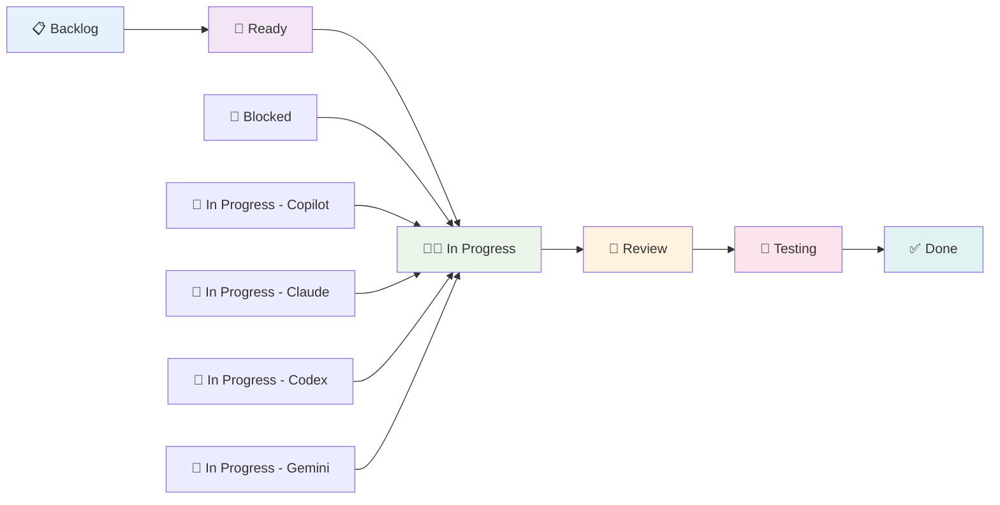
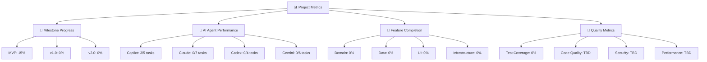

# 📋 GitHub Projects & Issues Management System
**AI-Driven Project Management for QuantumForce_Code 2.0**

[]()
[]()
[]()

---

## 🎯 Місія Project Management Системи

**Створити інтелектуальну систему управління проектами**, яка автоматично координує роботу 5 AI-агентів, відстежує прогрес та забезпечує якість доставки в контексті автомобільної діагностики.

### 🎭 Ключові Принципи

- ✅ **AI-First Workflow** - автоматизація для AI-агентів
- ✅ **Automotive Context** - спеціалізовані шаблони для автомобільної індустрії
- ✅ **Quality-Driven** - фокус на якості коду та документації
- ✅ **Transparency** - повна видимість прогресу для всіх учасників
- ✅ **Scalability** - готовність до росту команди та складності проекту

---

## 🏗️ GitHub Projects Architecture

### 📊 Project Board Structure



### 🎯 Project Board Columns

#### 📋 **Backlog**
- **Призначення:** Всі ідеї, завдання та вимоги
- **Критерії:** Неструктуровані ідеї, потребують деталізації
- **AI Role:** Cursor AI (Project Manager) - структурування

#### 🎯 **Ready**
- **Призначення:** Готові до виконання завдання
- **Критерії:**
  - ✅ Чіткий опис та acceptance criteria
  - ✅ Призначений AI-агент
  - ✅ Оцінений час виконання
  - ✅ Визначені залежності
- **AI Role:** Cursor AI - підготовка завдань

#### 👨‍💻 **In Progress**
- **Підколонки:**
  - 🔄 **In Progress - Copilot** (Domain Layer)
  - 🔄 **In Progress - Claude** (Data/UI Layer)
  - 🔄 **In Progress - Codex** (Infrastructure)
  - 🔄 **In Progress - Gemini** (QA & Testing)
- **Критерії:** Активна розробка
- **AI Role:** Відповідний агент

#### 👀 **Review**
- **Призначення:** Code review та архітектурна перевірка
- **Критерії:** PR створено, чекає на review
- **AI Role:** Cursor AI - code review

#### 🔧 **Testing**
- **Призначення:** Компіляція, тестування та інтеграція
- **Критерії:** Code review пройдено, тестування
- **AI Role:** Claude - компіляція та тестування

#### ✅ **Done**
- **Призначення:** Завершені та змержені завдання
- **Критерії:** Повністю готово до production
- **AI Role:** Всі агенти - завершення

---

## 📝 Issue Templates System

### 🤖 AI Agent Task Template

```markdown
---
name: AI Agent Task
about: Task assignment for AI agents (Copilot, Claude, Codex, Gemini)
title: '[AGENT] Task Name'
labels: ai-task, module:domain, priority:high
assignees: ''
---

## 🎯 Task Assignment

**AI Agent:** [Copilot/Claude/Codex/Gemini]
**Priority:** [🔴 High / 🟡 Medium / 🟢 Low]
**Estimated Time:** [1-3 hours / 1-2 days / 1 week]
**Module:** [domain/data/transport/protocol/features/ui]

---

## 📋 Task Description

[Clear description of what needs to be implemented]

---

## 📚 Documentation References

**Must Read:**
- [ ] `docs/INTERFACE_CONTRACTS.md` (section X)
- [ ] `docs/IMPLEMENTATION_EXAMPLES.md` (section Y)
- [ ] `docs/MODULAR_ARCHITECTURE_GUIDE.md` (if needed)

**Task Assignment File:**
- [ ] `.github/tasks/[AGENT]_TASKS.md` Task #N

---

## ✅ Acceptance Criteria

**Functional:**
- [ ] Feature works as expected
- [ ] All interface methods implemented
- [ ] Error handling in place

**Code Quality:**
- [ ] KDoc comments for public API
- [ ] Follows project conventions
- [ ] No compiler warnings

**Testing:**
- [ ] Unit tests written (or Issue created for Gemini)
- [ ] Tests pass
- [ ] Coverage > 70%

**Documentation:**
- [ ] README updated (if needed)
- [ ] Examples added (if complex feature)

---

## 📄 Files to Create/Modify

**Create:**
- `path/to/new/File1.kt`
- `path/to/new/File2.kt`

**Modify:**
- `path/to/existing/File3.kt` (add method X)

---

## 🔗 Dependencies

**Blocked by:**
- [ ] #IssueNumber - Description

**Blocks:**
- [ ] #IssueNumber - Description

---

## 💡 Implementation Notes

[Any specific hints, gotchas, or requirements]

**Example:**
```kotlin
// Expected interface to implement:
interface DtcRepository {
    suspend fun getDtcCodes(vehicleId: String): List<DtcCode>
}
```

---

## 🧪 Testing Instructions

**How to test:**
1. [Step 1]
2. [Step 2]
3. Expected result: [X]

**Test data:**
```kotlin
val testData = ...
```
```

### 🐛 Bug Report Template

```markdown
---
name: Bug Report
about: Report a bug in QuantumForce_Code
title: '[BUG] Brief description'
labels: bug, priority:medium
assignees: ''
---

## 🐛 Bug Description

**What happened:**
[A clear description of what the bug is]

**Expected behavior:**
[What you expected to happen]

**Actual behavior:**
[What actually happened]

---

## 🔍 Environment

**Device:** [Android tablet model]
**OS Version:** [Android version]
**App Version:** [QuantumForce version]
**Hardware:** [OBD adapter type]

---

## 📱 Steps to Reproduce

1. [First step]
2. [Second step]
3. [Third step]
4. [See error]

---

## 📊 Additional Context

**Screenshots:**
[If applicable, add screenshots]

**Logs:**
[If applicable, add logs]

**Related Issues:**
[Link to related issues]

---

## 🎯 Impact Assessment

**Severity:** [Critical/High/Medium/Low]
**Frequency:** [Always/Sometimes/Rare]
**Affected Users:** [All/Some/Specific]

---

## 🔧 Proposed Solution

[If you have ideas for fixing the bug]

---

## 📋 Checklist

- [ ] Bug is reproducible
- [ ] Steps are clear
- [ ] Environment is specified
- [ ] Impact is assessed
- [ ] Related issues checked
```

### ❓ Question Template

```markdown
---
name: Question
about: Ask a question about QuantumForce_Code
title: '[QUESTION] Brief question'
labels: question, help-wanted
assignees: ''
---

## ❓ Question

[Your question here]

---

## 🎯 Context

**What are you trying to achieve?**
[Describe your goal]

**What have you tried so far?**
[Describe what you've attempted]

**What specific help do you need?**
[Be specific about what you need]

---

## 📚 Relevant Documentation

**Have you checked:**
- [ ] `docs/README.md`
- [ ] `docs/guides/quick-start-ua.md`
- [ ] `docs/MODULAR_ARCHITECTURE_GUIDE.md`
- [ ] `docs/INTERFACE_CONTRACTS.md`
- [ ] `docs/IMPLEMENTATION_EXAMPLES.md`

---

## 🤖 AI Agent Tags

**Tag relevant AI agents:**
- [ ] `@cursor` (Project management, architecture)
- [ ] `@copilot` (Domain logic)
- [ ] `@claude` (Data/UI implementation)
- [ ] `@codex` (Infrastructure, protocols)
- [ ] `@gemini` (Testing, documentation)

---

## 📋 Additional Information

**Code snippets:**
```kotlin
// If relevant, include code
```

**Screenshots:**
[If applicable]

**Related issues:**
[Link to related issues]
```

---

## 🏷️ Labeling System

### 📊 Label Categories

#### 🤖 **AI Agent Labels**
- `ai:copilot` - GitHub Copilot tasks
- `ai:claude` - Claude tasks
- `ai:codex` - OpenAI Codex tasks
- `ai:gemini` - Google Gemini tasks
- `ai:cursor` - Cursor AI coordination

#### 🏗️ **Module Labels**
- `module:domain` - Domain layer
- `module:data` - Data layer
- `module:transport` - Transport layer
- `module:protocol` - Protocol layer
- `module:features` - Features layer
- `module:ui` - UI layer
- `module:app` - App layer

#### 🎯 **Priority Labels**
- `priority:critical` - Blocking other work
- `priority:high` - Important for MVP
- `priority:medium` - Nice to have
- `priority:low` - Future enhancement

#### 🚗 **Automotive Labels**
- `automotive:obd-ii` - OBD-II protocol
- `automotive:can` - CAN Bus protocol
- `automotive:uds` - UDS protocol
- `automotive:ev` - Electric vehicle specific
- `automotive:adas` - ADAS systems
- `automotive:multibrand` - Multi-brand support

#### 🧪 **Type Labels**
- `type:feature` - New feature
- `type:bug` - Bug fix
- `type:enhancement` - Improvement
- `type:documentation` - Documentation
- `type:test` - Testing
- `type:refactor` - Code refactoring

#### 🔧 **Status Labels**
- `status:ready` - Ready for work
- `status:in-progress` - Currently being worked on
- `status:blocked` - Blocked by dependencies
- `status:needs-review` - Needs code review
- `status:needs-testing` - Needs testing

---

## 📊 Milestones & Roadmaps

### 🎯 MVP Milestone (Weeks 1-6)

```markdown
## 🚀 MVP: Basic Diagnostic Functionality

**Goal:** Working app with basic DTC reading capability

**Features:**
- [ ] Domain Layer (Copilot)
  - [ ] DTC entities and repositories
  - [ ] Basic use cases
  - [ ] Unit tests
- [ ] Data Layer (Claude)
  - [ ] Room database setup
  - [ ] Repository implementations
  - [ ] Hilt DI configuration
- [ ] UI Layer (Claude)
  - [ ] Basic DTC screen
  - [ ] Dashboard
  - [ ] Navigation
- [ ] Infrastructure (Codex)
  - [ ] Bluetooth transport
  - [ ] ELM327 protocol
  - [ ] Basic OBD-II support
- [ ] Testing (Gemini)
  - [ ] Unit test coverage
  - [ ] Integration tests
  - [ ] UI tests

**Success Criteria:**
- ✅ App compiles and runs
- ✅ Can connect to OBD adapter
- ✅ Can read DTC codes
- ✅ Basic UI shows data
- ✅ Test coverage > 70%
```

### 🎯 v1.0 Milestone (Weeks 7-12)

```markdown
## 🎯 v1.0: Professional Features

**Goal:** Professional-grade diagnostic tool

**Features:**
- [ ] Advanced Protocols
  - [ ] CAN Bus support
  - [ ] UDS protocol
  - [ ] Multi-brand support
- [ ] Advanced UI
  - [ ] Live data monitoring
  - [ ] Freeze frame data
  - [ ] Actuator tests
- [ ] EV Support
  - [ ] BMS diagnostics
  - [ ] Charging protocols
  - [ ] High voltage safety
- [ ] ADAS Features
  - [ ] Camera diagnostics
  - [ ] Radar systems
  - [ ] Calibration procedures

**Success Criteria:**
- ✅ Support 20+ vehicle brands
- ✅ < 2 second scan time
- ✅ Professional UI/UX
- ✅ EV and ADAS support
- ✅ Test coverage > 80%
```

### 🎯 v2.0 Milestone (Weeks 13-20)

```markdown
## 🚀 v2.0: AI-Powered Intelligence

**Goal:** Next-generation AI-powered diagnostic tool

**Features:**
- [ ] AI Diagnostics
  - [ ] Intelligent fault analysis
  - [ ] Predictive maintenance
  - [ ] Repair recommendations
- [ ] Advanced Analytics
  - [ ] Diagnostic history
  - [ ] Performance trends
  - [ ] Fleet management
- [ ] Cloud Integration
  - [ ] Remote diagnostics
  - [ ] Update system
  - [ ] Telemetry
- [ ] Professional Tools
  - [ ] Coding/programming
  - [ ] Adaptations
  - [ ] Special functions

**Success Criteria:**
- ✅ AI-powered diagnostics
- ✅ Cloud integration
- ✅ Professional tools
- ✅ Fleet management
- ✅ Test coverage > 85%
```

---

## 🔄 Automation Rules

### 🤖 Auto-Assignment Rules

```yaml
# .github/auto-assignment.yml
rules:
  - name: "Auto-assign AI agents"
    conditions:
      - label: "ai:copilot"
    actions:
      - assign: "copilot-agent"
      - move_to_column: "In Progress - Copilot"

  - name: "Auto-assign Claude"
    conditions:
      - label: "ai:claude"
    actions:
      - assign: "claude-agent"
      - move_to_column: "In Progress - Claude"

  - name: "Auto-assign Codex"
    conditions:
      - label: "ai:codex"
    actions:
      - assign: "codex-agent"
      - move_to_column: "In Progress - Codex"

  - name: "Auto-assign Gemini"
    conditions:
      - label: "ai:gemini"
    actions:
      - assign: "gemini-agent"
      - move_to_column: "In Progress - Gemini"
```

### 📊 Auto-Status Updates

```yaml
  - name: "Move to Review on PR"
    conditions:
      - event: "pull_request"
      - action: "opened"
    actions:
      - move_to_column: "Review"
      - add_label: "status:needs-review"

  - name: "Move to Testing on Merge"
    conditions:
      - event: "pull_request"
      - action: "closed"
      - merged: true
    actions:
      - move_to_column: "Testing"
      - add_label: "status:needs-testing"

  - name: "Move to Done on Success"
    conditions:
      - workflow: "ci-main.yml"
      - status: "success"
    actions:
      - move_to_column: "Done"
      - remove_label: "status:needs-testing"
```

---

## 📈 Progress Tracking

### 📊 Project Metrics Dashboard



### 📈 KPI Tracking

| Метрика | Ціль | Поточний | Тренд |
|---------|------|----------|-------|
| **Issues Closed/Week** | 10-15 | 0 | 📈 |
| **PRs Merged/Week** | 5-8 | 0 | 📈 |
| **First-time Approval** | > 80% | TBD | 📊 |
| **Average PR Time** | < 2 days | TBD | 📊 |
| **Bug Rate** | < 5% | TBD | 📉 |
| **Feature Completion** | On time | TBD | 📈 |

---

## 🎯 Best Practices

### 🤖 For AI Agents

#### ✅ **Do's**
- **Чіткі коміти** - Atomic commits з описовими повідомленнями
- **Структуровані Issues** - Використовуй templates та labels
- **Регулярні оновлення** - Коментуй прогрес в Issues
- **Якісні PR** - Детальні описи та тести
- **Документація** - Оновлюй README та KDoc

#### ❌ **Don'ts**
- **Великі PR** - Розбивай на менші частини
- **Незавершені завдання** - Не коміть incomplete код
- **Ігнорування review** - Відповідай на коментарі
- **Дублювання** - Перевіряй існуючі Issues
- **Загрози** - Не блокуй інших агентів

### 👨‍💻 For Project Manager (Cursor AI)

#### ✅ **Do's**
- **Регулярний моніторинг** - Щоденна перевірка прогресу
- **Швидкий review** - Відповідай на PR протягом 24 годин
- **Конфлікт resolution** - Швидко вирішуй блокери
- **Комунікація** - Інформуй про зміни та рішення
- **Документація** - Підтримуй актуальність docs

#### ❌ **Don'ts**
- **Мікроменеджмент** - Не контролюй кожен крок
- **Затримки** - Не блокуй роботу агентів
- **Неясність** - Не залишай неясних завдань
- **Ігнорування** - Не ігноруй питання агентів
- **Зміни без узгодження** - Обговорюй архітектурні зміни

---

## 🔮 Future Enhancements

### 📅 Phase 1: Basic Automation (Weeks 1-4)
- ✅ Issue templates setup
- ✅ Basic project board
- ✅ Label system
- ✅ Auto-assignment rules

### 📅 Phase 2: Advanced Automation (Weeks 5-8)
- ✅ Automated status updates
- ✅ Progress tracking
- ✅ Metrics dashboard
- ✅ Notification system

### 📅 Phase 3: Intelligence (Weeks 9-12)
- ✅ AI-powered issue classification
- ✅ Predictive project management
- ✅ Automated risk assessment
- ✅ Smart resource allocation

### 📅 Phase 4: Scale (Weeks 13-16)
- ✅ Multi-project coordination
- ✅ Advanced analytics
- ✅ Machine learning insights
- ✅ Continuous improvement

---

## 🎉 Висновок

Ця система управління проектами забезпечує:

✅ **Координацію** - Ефективну роботу 5 AI-агентів
✅ **Прозорість** - Повну видимість прогресу
✅ **Якість** - Контроль якості на кожному етапі
✅ **Автоматизацію** - Мінімум ручної роботи
✅ **Масштабованість** - Готовність до росту проекту

**Результат:** Інтелектуальна система управління проектами, яка автоматично координує роботу AI-команди та забезпечує високу якість доставки в контексті автомобільної діагностики.

---

**Автор:** Cursor AI (AI Program Director)
**Версія:** 1.0.0
**Дата:** 2025-01-20
**Статус:** ✅ ГОТОВО ДО ВПРОВАДЖЕННЯ

*Ця документація є живим документом, що постійно оновлюється відповідно до розвитку проекту та нових вимог команди.*
