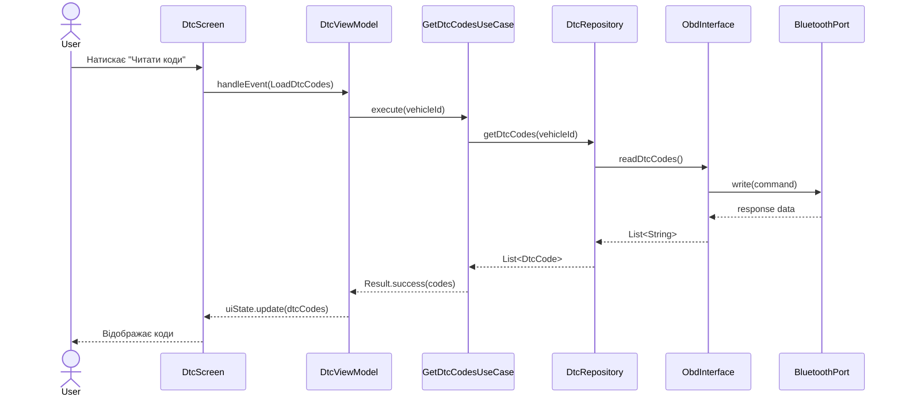

# 🏗️ Повний Посібник з Модульної Архітектури | Complete Modular Architecture Guide

## 📋 Зміст / Table of Contents

1. [Огляд архітектури](#огляд-архітектури)
2. [Принципи Clean Architecture](#принципи-clean-architecture)
3. [Модулі та їх інтерфейси](#модулі-та-їх-інтерфейси)
4. [Приклади реалізації](#приклади-реалізації)
5. [Діаграми взаємодії](#діаграми-взаємодії)
6. [Впровадження в проєкт](#впровадження-в-проєкт)

---

## 🎯 Огляд архітектури

### Основна концепція

Проєкт **QuantumForce_Code** побудовано на принципах **Clean Architecture** з чітким розділенням відповідальностей між шарами. Кожен модуль має власні інтерфейси, які служать контрактами для взаємодії з іншими модулями.

### Ключові принципи

1. **Separation of Concerns** - кожен модуль має одну чітко визначену відповідальність
2. **Dependency Inversion** - залежності спрямовані від зовнішніх шарів до внутрішніх
3. **Interface Segregation** - інтерфейси є невеликими та специфічними
4. **Single Responsibility** - клас має тільки одну причину для зміни
5. **Testability** - кожен компонент можна тестувати ізольовано

### Архітектурні шари

```
┌─────────────────────────────────────────────────────────────┐
│                    PRESENTATION (UI)                         │
│            Features, ViewModels, Screens                     │
├─────────────────────────────────────────────────────────────┤
│                    DOMAIN (Business Logic)                   │
│            UseCases, Entities, Interfaces                    │
├─────────────────────────────────────────────────────────────┤
│                    DATA (Repositories)                       │
│       Repository Impl, Data Sources, Mappers                 │
├─────────────────────────────────────────────────────────────┤
│                    FRAMEWORKS (Infrastructure)               │
│         Hardware, Protocols, Security, Updates               │
└─────────────────────────────────────────────────────────────┘
```

---

## 🧱 Принципи Clean Architecture

### 1. Незалежність від фреймворків

Бізнес-логіка не залежить від Android SDK, Room, або інших фреймворків. Це дозволяє:
- Легко змінювати технології
- Тестувати без емуляторів
- Переносити код на інші платформи

### 2. Незалежність від UI

Domain шар не знає про існування UI. Все спілкування відбувається через інтерфейси.

### 3. Незалежність від бази даних

Можна змінити SQLite на інше сховище без зміни бізнес-логіки.

### 4. Тестовність

Кожен компонент можна тестувати ізольовано з використанням моків та стабів.

---

## 📦 Модулі та їх інтерфейси

### 1️⃣ Core Domain Module (`core:domain`)

**Призначення**: Визначає бізнес-сутності та правила, незалежні від технічних деталей.

#### Інтерфейси

##### UseCase - Базовий контракт для бізнес-операцій

```kotlin
/**
 * Базовий клас для всіх Use Case в додатку.
 * 
 * Призначення: Інкапсулює окрему бізнес-операцію.
 * Принципи: Single Responsibility, Command Pattern
 * 
 * @param P - тип параметрів для виконання операції
 * @param R - тип результату операції
 */
abstract class UseCase<in P, out R> {
    /**
     * Виконує бізнес-логіку use case.
     * 
     * @param parameters вхідні дані для операції
     * @return Result<R> - успішний результат або помилка
     */
    abstract suspend fun execute(parameters: P): Result<R>
    
    /**
     * Викликає use case з автоматичною обробкою винятків.
     */
    suspend operator fun invoke(parameters: P): Result<R> {
        return try {
            execute(parameters)
        } catch (e: Exception) {
            Result.failure(e)
        }
    }
}
```

**Приклад використання:**

```kotlin
// Конкретний use case для отримання DTC кодів
class GetDtcCodesUseCase(
    private val dtcRepository: DtcRepository
) : UseCase<GetDtcCodesUseCase.Params, List<DtcCode>>() {
    
    data class Params(
        val vehicleId: String,
        val includeCleared: Boolean = false
    )
    
    override suspend fun execute(parameters: Params): Result<List<DtcCode>> {
        return try {
            val codes = dtcRepository.getDtcCodes(
                vehicleId = parameters.vehicleId,
                includeCleared = parameters.includeCleared
            )
            Result.success(codes)
        } catch (e: Exception) {
            Result.failure(e)
        }
    }
}
```

#### Доменні сутності

##### Vehicle - Модель автомобіля

```kotlin
/**
 * Доменна модель автомобіля.
 * 
 * Призначення: Представляє автомобіль у бізнес-логіці.
 * Принципи: Value Object, Immutability
 */
data class Vehicle(
    val id: String,
    val make: String,          // Виробник (VW, BMW, Mercedes)
    val model: String,         // Модель (Golf, 320i, C-Class)
    val year: Int,             // Рік випуску
    val vin: String?,          // VIN номер
    val protocol: Protocol,    // Протокол діагностики
    val ecuAddresses: List<String> = emptyList() // Адреси ECU
) {
    enum class Protocol {
        OBD2_ISO9141,
        OBD2_ISO14230,
        OBD2_ISO15765,
        CAN_BUS,
        KWP2000,
        UDS,
        MANUFACTURER_SPECIFIC
    }
    
    /**
     * Перевіряє, чи підтримує автомобіль розширену діагностику.
     */
    fun supportsAdvancedDiagnostics(): Boolean {
        return protocol in listOf(
            Protocol.KWP2000,
            Protocol.UDS,
            Protocol.MANUFACTURER_SPECIFIC
        )
    }
}
```

##### DtcCode - Код помилки діагностики

```kotlin
/**
 * Доменна модель коду помилки (Diagnostic Trouble Code).
 * 
 * Призначення: Представляє код помилки з усією інформацією.
 * Принципи: Rich Domain Model
 */
data class DtcCode(
    val code: String,                      // Код (напр. P0301)
    val description: String,               // Опис помилки
    val severity: Severity,                // Рівень критичності
    val causes: List<String>,              // Можливі причини
    val solutions: List<String>,           // Рекомендовані рішення
    val affectedSystems: List<String>,     // Задіяні системи
    val timestamp: Long? = null,           // Час виявлення
    val freezeFrame: FreezeFrame? = null   // Кадр даних при помилці
) {
    enum class Severity {
        LOW,        // Незначна, не впливає на роботу
        MEDIUM,     // Помірна, може вплинути на продуктивність
        HIGH,       // Серйозна, впливає на роботу
        CRITICAL    // Критична, вимагає негайного ремонту
    }
    
    data class FreezeFrame(
        val engineSpeed: Int?,    // Обороти двигуна
        val vehicleSpeed: Int?,   // Швидкість авто
        val coolantTemp: Int?,    // Температура охолоджувальної рідини
        val loadValue: Float?     // Навантаження двигуна
    )
    
    /**
     * Визначає, чи вимагає код негайної уваги.
     */
    fun requiresImmediateAttention(): Boolean {
        return severity == Severity.CRITICAL
    }
    
    /**
     * Форматує код для відображення.
     */
    fun formatForDisplay(): String {
        return "$code - $description"
    }
}
```

##### DiagnosticSession - Сесія діагностики

```kotlin
/**
 * Доменна модель сесії діагностики.
 * 
 * Призначення: Представляє процес діагностування автомобіля.
 * Принципи: Aggregate Root, State Pattern
 */
data class DiagnosticSession(
    val id: String,
    val vehicleId: String,
    val startTime: Long,
    val endTime: Long? = null,
    val status: Status,
    val dtcCodes: List<DtcCode> = emptyList(),
    val liveData: Map<String, Any> = emptyMap(),
    val notes: String = ""
) {
    enum class Status {
        IN_PROGRESS,    // Діагностика триває
        COMPLETED,      // Завершена успішно
        FAILED,         // Завершена з помилкою
        CANCELLED       // Скасована користувачем
    }
    
    /**
     * Завершує сесію з результатами.
     */
    fun complete(dtcCodes: List<DtcCode>): DiagnosticSession {
        return copy(
            endTime = System.currentTimeMillis(),
            status = Status.COMPLETED,
            dtcCodes = dtcCodes
        )
    }
    
    /**
     * Скасовує сесію.
     */
    fun cancel(): DiagnosticSession {
        return copy(
            endTime = System.currentTimeMillis(),
            status = Status.CANCELLED
        )
    }
    
    /**
     * Перевіряє, чи активна сесія.
     */
    fun isActive(): Boolean {
        return status == Status.IN_PROGRESS
    }
}
```

---

### 2️⃣ Core Data Module (`core:data`)

**Призначення**: Реалізує доступ до даних, взаємодіє з базою даних та зовнішніми джерелами.

#### Інтерфейси

##### Repository Interfaces - Контракти для доступу до даних

```kotlin
/**
 * Інтерфейс репозиторію для роботи з DTC кодами.
 * 
 * Призначення: Визначає операції для доступу до кодів помилок.
 * Принципи: Repository Pattern, Interface Segregation
 */
interface DtcRepository {
    /**
     * Отримує всі DTC коди для автомобіля.
     */
    suspend fun getDtcCodes(
        vehicleId: String,
        includeCleared: Boolean = false
    ): List<DtcCode>
    
    /**
     * Отримує DTC код за кодом.
     */
    suspend fun getDtcByCode(code: String): DtcCode?
    
    /**
     * Зберігає DTC код.
     */
    suspend fun saveDtcCode(dtcCode: DtcCode): Result<Unit>
    
    /**
     * Видаляє всі DTC коди для автомобіля.
     */
    suspend fun clearDtcCodes(vehicleId: String): Result<Unit>
    
    /**
     * Шукає DTC коди за ключовим словом.
     */
    suspend fun searchDtcCodes(query: String): List<DtcCode>
}

/**
 * Інтерфейс репозиторію для роботи з автомобілями.
 */
interface VehicleRepository {
    /**
     * Отримує всі збережені автомобілі.
     */
    suspend fun getAllVehicles(): List<Vehicle>
    
    /**
     * Отримує автомобіль за ID.
     */
    suspend fun getVehicleById(id: String): Vehicle?
    
    /**
     * Зберігає автомобіль.
     */
    suspend fun saveVehicle(vehicle: Vehicle): Result<Unit>
    
    /**
     * Видаляє автомобіль.
     */
    suspend fun deleteVehicle(id: String): Result<Unit>
    
    /**
     * Оновлює інформацію про автомобіль.
     */
    suspend fun updateVehicle(vehicle: Vehicle): Result<Unit>
}

/**
 * Інтерфейс репозиторію для сесій діагностики.
 */
interface DiagnosticSessionRepository {
    /**
     * Створює нову сесію.
     */
    suspend fun createSession(vehicleId: String): DiagnosticSession
    
    /**
     * Оновлює сесію.
     */
    suspend fun updateSession(session: DiagnosticSession): Result<Unit>
    
    /**
     * Отримує активну сесію.
     */
    suspend fun getActiveSession(): DiagnosticSession?
    
    /**
     * Отримує історію сесій для автомобіля.
     */
    suspend fun getSessionHistory(vehicleId: String): List<DiagnosticSession>
}
```

#### Room Database Entities

```kotlin
/**
 * Entity для збереження DTC кодів у базі даних.
 * 
 * Призначення: Модель даних для Room ORM.
 * Мапиться на доменну модель через DataMappers.
 */
@Entity(tableName = "dtc_codes")
data class DtcEntity(
    @PrimaryKey val code: String,
    @ColumnInfo(name = "description") val description: String,
    @ColumnInfo(name = "severity") val severity: String,
    @ColumnInfo(name = "causes") val causes: String, // JSON array
    @ColumnInfo(name = "solutions") val solutions: String, // JSON array
    @ColumnInfo(name = "affected_systems") val affectedSystems: String, // JSON array
    @ColumnInfo(name = "timestamp") val timestamp: Long?,
    @ColumnInfo(name = "freeze_frame") val freezeFrame: String? // JSON object
)

/**
 * Entity для збереження автомобілів.
 */
@Entity(tableName = "vehicles")
data class VehicleEntity(
    @PrimaryKey val id: String,
    @ColumnInfo(name = "make") val make: String,
    @ColumnInfo(name = "model") val model: String,
    @ColumnInfo(name = "year") val year: Int,
    @ColumnInfo(name = "vin") val vin: String?,
    @ColumnInfo(name = "protocol") val protocol: String,
    @ColumnInfo(name = "ecu_addresses") val ecuAddresses: String // JSON array
)
```

#### Data Mappers

```kotlin
/**
 * Mapper для конвертації між Entity та Domain моделями.
 * 
 * Призначення: Трансформує дані між шарами.
 * Принципи: Mapper Pattern, Separation of Concerns
 */
object DataMappers {
    /**
     * Конвертує DtcEntity в DtcCode (domain model).
     */
    fun DtcEntity.toDomain(): DtcCode {
        return DtcCode(
            code = code,
            description = description,
            severity = DtcCode.Severity.valueOf(severity),
            causes = Json.decodeFromString(causes),
            solutions = Json.decodeFromString(solutions),
            affectedSystems = Json.decodeFromString(affectedSystems),
            timestamp = timestamp,
            freezeFrame = freezeFrame?.let { 
                Json.decodeFromString(it) 
            }
        )
    }
    
    /**
     * Конвертує DtcCode (domain model) в DtcEntity.
     */
    fun DtcCode.toEntity(): DtcEntity {
        return DtcEntity(
            code = code,
            description = description,
            severity = severity.name,
            causes = Json.encodeToString(causes),
            solutions = Json.encodeToString(solutions),
            affectedSystems = Json.encodeToString(affectedSystems),
            timestamp = timestamp,
            freezeFrame = freezeFrame?.let { 
                Json.encodeToString(it) 
            }
        )
    }
    
    /**
     * Конвертує VehicleEntity в Vehicle.
     */
    fun VehicleEntity.toDomain(): Vehicle {
        return Vehicle(
            id = id,
            make = make,
            model = model,
            year = year,
            vin = vin,
            protocol = Vehicle.Protocol.valueOf(protocol),
            ecuAddresses = Json.decodeFromString(ecuAddresses)
        )
    }
    
    /**
     * Конвертує Vehicle в VehicleEntity.
     */
    fun Vehicle.toEntity(): VehicleEntity {
        return VehicleEntity(
            id = id,
            make = make,
            model = model,
            year = year,
            vin = vin,
            protocol = protocol.name,
            ecuAddresses = Json.encodeToString(ecuAddresses)
        )
    }
}
```

#### DAO Interfaces

```kotlin
/**
 * DAO для роботи з DTC кодами в Room.
 * 
 * Призначення: Визначає SQL операції для DTC.
 */
@Dao
interface DtcDao {
    @Query("SELECT * FROM dtc_codes WHERE code = :code")
    suspend fun getDtcByCode(code: String): DtcEntity?
    
    @Query("SELECT * FROM dtc_codes")
    suspend fun getAllDtcCodes(): List<DtcEntity>
    
    @Query("SELECT * FROM dtc_codes WHERE description LIKE '%' || :query || '%' OR code LIKE '%' || :query || '%'")
    suspend fun searchDtcCodes(query: String): List<DtcEntity>
    
    @Insert(onConflict = OnConflictStrategy.REPLACE)
    suspend fun insertDtcCode(dtc: DtcEntity)
    
    @Delete
    suspend fun deleteDtcCode(dtc: DtcEntity)
    
    @Query("DELETE FROM dtc_codes")
    suspend fun clearAllDtcCodes()
}

/**
 * DAO для роботи з автомобілями.
 */
@Dao
interface VehicleDao {
    @Query("SELECT * FROM vehicles")
    suspend fun getAllVehicles(): List<VehicleEntity>
    
    @Query("SELECT * FROM vehicles WHERE id = :id")
    suspend fun getVehicleById(id: String): VehicleEntity?
    
    @Insert(onConflict = OnConflictStrategy.REPLACE)
    suspend fun insertVehicle(vehicle: VehicleEntity)
    
    @Update
    suspend fun updateVehicle(vehicle: VehicleEntity)
    
    @Delete
    suspend fun deleteVehicle(vehicle: VehicleEntity)
}
```

---

### 3️⃣ Hardware Transport Module (`hardware:transport`)

**Призначення**: Забезпечує комунікацію з апаратними пристроями через різні канали.

#### Інтерфейси

##### Port - Базовий інтерфейс для транспортних каналів

```kotlin
/**
 * Базовий інтерфейс для всіх типів транспортних каналів.
 * 
 * Призначення: Визначає контракт для комунікації з апаратурою.
 * Принципи: Interface Segregation, Dependency Inversion
 */
interface Port {
    /**
     * Відкриває з'єднання з пристроєм.
     * 
     * @return true якщо з'єднання встановлено успішно
     */
    suspend fun open(): Result<Boolean>
    
    /**
     * Закриває з'єднання.
     */
    suspend fun close()
    
    /**
     * Записує дані у порт.
     * 
     * @param data байтовий масив для відправлення
     * @return true якщо запис успішний
     */
    suspend fun write(data: ByteArray): Result<Boolean>
    
    /**
     * Читає дані з порту.
     * 
     * @param timeout час очікування в мілісекундах
     * @return прочитані дані або null
     */
    suspend fun read(timeout: Long = 1000): Result<ByteArray>
    
    /**
     * Перевіряє, чи активне з'єднання.
     */
    val isConnected: Boolean
    
    /**
     * Отримує інформацію про порт.
     */
    val info: PortInfo
    
    data class PortInfo(
        val type: PortType,
        val address: String,
        val name: String
    )
    
    enum class PortType {
        BLUETOOTH,
        USB_SERIAL,
        TCP,
        MOCK
    }
}
```

##### ConnectionManager - Менеджер з'єднань

```kotlin
/**
 * Інтерфейс для управління з'єднаннями з пристроями.
 * 
 * Призначення: Керує життєвим циклом з'єднань та автоматичним перепід'єднанням.
 */
interface ConnectionManager {
    /**
     * Встановлює з'єднання з пристроєм.
     */
    suspend fun connect(config: ConnectionConfig): Result<Port>
    
    /**
     * Розриває поточне з'єднання.
     */
    suspend fun disconnect()
    
    /**
     * Отримує поточний порт.
     */
    fun getCurrentPort(): Port?
    
    /**
     * Перевіряє доступність пристрою.
     */
    suspend fun isDeviceAvailable(config: ConnectionConfig): Boolean
    
    /**
     * Сканує доступні пристрої.
     */
    suspend fun scanDevices(): List<DeviceInfo>
    
    /**
     * Налаштовує автоматичне перепід'єднання.
     */
    fun setAutoReconnect(enabled: Boolean, maxAttempts: Int = 3)
    
    data class ConnectionConfig(
        val type: Port.PortType,
        val address: String,
        val baudRate: Int = 38400,
        val timeout: Long = 5000
    )
    
    data class DeviceInfo(
        val name: String,
        val address: String,
        val type: Port.PortType,
        val isAvailable: Boolean
    )
}
```

#### Реалізації

##### BluetoothPort

```kotlin
/**
 * Реалізація Bluetooth транспорту.
 * 
 * Призначення: Забезпечує комунікацію через Bluetooth SPP.
 */
class BluetoothPort(
    private val device: BluetoothDevice,
    private val context: Context
) : Port {
    
    private var socket: BluetoothSocket? = null
    private var inputStream: InputStream? = null
    private var outputStream: OutputStream? = null
    
    override suspend fun open(): Result<Boolean> = withContext(Dispatchers.IO) {
        try {
            // UUID для Bluetooth SPP (Serial Port Profile)
            val uuid = UUID.fromString("00001101-0000-1000-8000-00805F9B34FB")
            socket = device.createRfcommSocketToServiceRecord(uuid)
            socket?.connect()
            inputStream = socket?.inputStream
            outputStream = socket?.outputStream
            Result.success(true)
        } catch (e: IOException) {
            Result.failure(e)
        }
    }
    
    override suspend fun close() = withContext(Dispatchers.IO) {
        try {
            outputStream?.close()
            inputStream?.close()
            socket?.close()
        } catch (e: IOException) {
            // Log error
        }
    }
    
    override suspend fun write(data: ByteArray): Result<Boolean> = withContext(Dispatchers.IO) {
        try {
            outputStream?.write(data)
            outputStream?.flush()
            Result.success(true)
        } catch (e: IOException) {
            Result.failure(e)
        }
    }
    
    override suspend fun read(timeout: Long): Result<ByteArray> = withContext(Dispatchers.IO) {
        try {
            val buffer = ByteArray(1024)
            val bytesRead = inputStream?.read(buffer) ?: 0
            Result.success(buffer.copyOf(bytesRead))
        } catch (e: IOException) {
            Result.failure(e)
        }
    }
    
    override val isConnected: Boolean
        get() = socket?.isConnected == true
    
    override val info: Port.PortInfo
        get() = Port.PortInfo(
            type = Port.PortType.BLUETOOTH,
            address = device.address,
            name = device.name ?: "Unknown"
        )
}
```

---

### 4️⃣ Protocols OBD Module (`protocols:obd`)

**Призначення**: Реалізує протоколи OBD-II комунікації та парсинг даних.

#### Інтерфейси

##### ObdInterface - Контракт для OBD комунікації

```kotlin
/**
 * Інтерфейс для роботи з OBD-II пристроями.
 * 
 * Призначення: Визначає операції для діагностики через OBD-II.
 */
interface ObdInterface {
    /**
     * Ініціалізує з'єднання з адаптером.
     */
    suspend fun initialize(): Result<Boolean>
    
    /**
     * Відправляє команду та отримує відповідь.
     */
    suspend fun sendCommand(command: ObdCommand): Result<ObdResponse>
    
    /**
     * Читає DTC коди.
     */
    suspend fun readDtcCodes(): Result<List<String>>
    
    /**
     * Очищує DTC коди.
     */
    suspend fun clearDtcCodes(): Result<Boolean>
    
    /**
     * Читає PID (Parameter ID).
     */
    suspend fun readPid(pid: String): Result<PidData>
    
    /**
     * Визначає протокол автомобіля.
     */
    suspend fun detectProtocol(): Result<ObdProtocol>
    
    /**
     * Перевіряє з'єднання.
     */
    fun isConnected(): Boolean
    
    /**
     * Отримує інформацію про адаптер.
     */
    suspend fun getAdapterInfo(): Result<AdapterInfo>
}
```

##### ObdCommand - Модель команди

```kotlin
/**
 * Sealed class для OBD команд.
 * 
 * Призначення: Типобезпечне представлення OBD команд.
 */
sealed class ObdCommand(val command: String) {
    /**
     * Команди ELM327.
     */
    sealed class AT(command: String) : ObdCommand(command) {
        object Reset : AT("ATZ")
        object Echo : AT("ATE0")
        object Headers : AT("ATH1")
        object LineFeed : AT("ATL0")
        object Spaces : AT("ATS0")
        data class SetProtocol(val protocol: Int) : AT("ATSP$protocol")
        object AutoProtocol : AT("ATSP0")
    }
    
    /**
     * OBD Mode 01 - поточні дані.
     */
    sealed class Mode01(pid: String) : ObdCommand("01$pid") {
        object EngineRPM : Mode01("0C")
        object VehicleSpeed : Mode01("0D")
        object ThrottlePosition : Mode01("11")
        object EngineCoolantTemp : Mode01("05")
        object FuelPressure : Mode01("0A")
    }
    
    /**
     * OBD Mode 03 - читання DTC.
     */
    object ReadDTC : ObdCommand("03")
    
    /**
     * OBD Mode 04 - очищення DTC.
     */
    object ClearDTC : ObdCommand("04")
    
    /**
     * OBD Mode 09 - інформація про автомобіль.
     */
    sealed class Mode09(pid: String) : ObdCommand("09$pid") {
        object VIN : Mode09("02")
        object CalibrationID : Mode09("04")
    }
    
    /**
     * Кастомна команда.
     */
    data class Custom(val customCommand: String) : ObdCommand(customCommand)
}
```

##### ObdResponse - Модель відповіді

```kotlin
/**
 * Модель відповіді від OBD пристрою.
 */
data class ObdResponse(
    val rawData: String,
    val status: Status,
    val parsedValue: Any? = null,
    val unit: String? = null,
    val timestamp: Long = System.currentTimeMillis()
) {
    enum class Status {
        SUCCESS,
        ERROR,
        NO_DATA,
        TIMEOUT,
        UNSUPPORTED
    }
    
    fun isSuccess(): Boolean = status == Status.SUCCESS
    
    fun asInt(): Int? = parsedValue as? Int
    fun asFloat(): Float? = parsedValue as? Float
    fun asString(): String? = parsedValue as? String
}
```

##### PidParser - Парсер параметрів

```kotlin
/**
 * Інтерфейс для парсингу PID даних.
 * 
 * Призначення: Конвертує сирі дані OBD у зручний формат.
 */
interface PidParser {
    /**
     * Парсить відповідь PID.
     */
    fun parse(rawData: String, pid: String): Result<PidData>
    
    /**
     * Отримує інформацію про PID.
     */
    fun getPidInfo(pid: String): PidInfo?
    
    data class PidData(
        val pid: String,
        val value: Any,
        val unit: String,
        val name: String,
        val timestamp: Long = System.currentTimeMillis()
    )
    
    data class PidInfo(
        val pid: String,
        val name: String,
        val description: String,
        val unit: String,
        val minValue: Float?,
        val maxValue: Float?,
        val formula: String
    )
}
```

---

### 5️⃣ Features Module (`features:dtc`, `features:live`)

**Призначення**: Інкапсулює специфічні функції додатку (DTC діагностика, Live дані).

#### Інтерфейси для Features

##### ViewModel Contract

```kotlin
/**
 * Базовий інтерфейс для всіх ViewModels у додатку.
 * 
 * Призначення: Визначає контракт для управління UI станом.
 */
interface BaseViewModel<S : UiState, E : UiEvent> {
    /**
     * StateFlow для спостереження за станом UI.
     */
    val uiState: StateFlow<S>
    
    /**
     * Обробляє події з UI.
     */
    fun handleEvent(event: E)
    
    /**
     * SharedFlow для одноразових ефектів.
     */
    val effects: SharedFlow<UiEffect>
}

/**
 * Маркерний інтерфейс для UI стану.
 */
interface UiState

/**
 * Маркерний інтерфейс для UI подій.
 */
interface UiEvent

/**
 * Маркерний інтерфейс для UI ефектів.
 */
interface UiEffect
```

##### DTC Feature Interfaces

```kotlin
/**
 * UI стан для DTC екрану.
 */
data class DtcUiState(
    val isLoading: Boolean = false,
    val dtcCodes: List<DtcCode> = emptyList(),
    val selectedVehicle: Vehicle? = null,
    val error: String? = null,
    val connectionStatus: ConnectionStatus = ConnectionStatus.DISCONNECTED
) : UiState {
    enum class ConnectionStatus {
        CONNECTED,
        DISCONNECTED,
        CONNECTING,
        ERROR
    }
}

/**
 * UI події для DTC екрану.
 */
sealed class DtcEvent : UiEvent {
    object LoadDtcCodes : DtcEvent()
    object ClearDtcCodes : DtcEvent()
    object RefreshConnection : DtcEvent()
    data class SelectVehicle(val vehicle: Vehicle) : DtcEvent()
    data class SelectDtcCode(val code: DtcCode) : DtcEvent()
}

/**
 * UI ефекти для DTC екрану.
 */
sealed class DtcEffect : UiEffect {
    data class ShowToast(val message: String) : DtcEffect()
    data class NavigateToDetails(val dtcCode: DtcCode) : DtcEffect()
    object NavigateBack : DtcEffect()
}
```

##### DtcViewModel Implementation

```kotlin
/**
 * ViewModel для DTC функціоналу.
 * 
 * Призначення: Керує логікою DTC екрану та взаємодіє з domain шаром.
 */
class DtcViewModel(
    private val getDtcCodesUseCase: GetDtcCodesUseCase,
    private val clearDtcCodesUseCase: ClearDtcCodesUseCase,
    private val connectionManager: ConnectionManager
) : ViewModel(), BaseViewModel<DtcUiState, DtcEvent> {
    
    private val _uiState = MutableStateFlow(DtcUiState())
    override val uiState: StateFlow<DtcUiState> = _uiState.asStateFlow()
    
    private val _effects = MutableSharedFlow<UiEffect>()
    override val effects: SharedFlow<UiEffect> = _effects.asSharedFlow()
    
    override fun handleEvent(event: DtcEvent) {
        when (event) {
            is DtcEvent.LoadDtcCodes -> loadDtcCodes()
            is DtcEvent.ClearDtcCodes -> clearDtcCodes()
            is DtcEvent.RefreshConnection -> refreshConnection()
            is DtcEvent.SelectVehicle -> selectVehicle(event.vehicle)
            is DtcEvent.SelectDtcCode -> showDtcDetails(event.code)
        }
    }
    
    private fun loadDtcCodes() {
        viewModelScope.launch {
            _uiState.update { it.copy(isLoading = true, error = null) }
            
            val vehicleId = _uiState.value.selectedVehicle?.id
            if (vehicleId == null) {
                _uiState.update { 
                    it.copy(
                        isLoading = false,
                        error = "Виберіть автомобіль"
                    ) 
                }
                return@launch
            }
            
            val result = getDtcCodesUseCase(
                GetDtcCodesUseCase.Params(vehicleId = vehicleId)
            )
            
            result.fold(
                onSuccess = { codes ->
                    _uiState.update { 
                        it.copy(
                            isLoading = false,
                            dtcCodes = codes,
                            error = null
                        ) 
                    }
                },
                onFailure = { error ->
                    _uiState.update { 
                        it.copy(
                            isLoading = false,
                            error = error.message
                        ) 
                    }
                }
            )
        }
    }
    
    private fun clearDtcCodes() {
        viewModelScope.launch {
            _uiState.update { it.copy(isLoading = true) }
            
            val vehicleId = _uiState.value.selectedVehicle?.id ?: return@launch
            
            clearDtcCodesUseCase(
                ClearDtcCodesUseCase.Params(vehicleId = vehicleId)
            ).fold(
                onSuccess = {
                    _effects.emit(DtcEffect.ShowToast("DTC коди очищено"))
                    loadDtcCodes()
                },
                onFailure = { error ->
                    _uiState.update { 
                        it.copy(
                            isLoading = false,
                            error = error.message
                        ) 
                    }
                }
            )
        }
    }
    
    private fun refreshConnection() {
        // Реалізація оновлення з'єднання
    }
    
    private fun selectVehicle(vehicle: Vehicle) {
        _uiState.update { it.copy(selectedVehicle = vehicle) }
    }
    
    private fun showDtcDetails(code: DtcCode) {
        viewModelScope.launch {
            _effects.emit(DtcEffect.NavigateToDetails(code))
        }
    }
}
```

---

### 6️⃣ Security Module (`security`)

**Призначення**: Забезпечує безпеку додатку, логування та контроль доступу.

#### Інтерфейси

```kotlin
/**
 * Інтерфейс політики безпеки.
 * 
 * Призначення: Визначає правила безпеки для додатку.
 */
interface SecurityPolicy {
    /**
     * Перевіряє дозволи для операції.
     */
    fun checkPermission(operation: Operation): Boolean
    
    /**
     * Шифрує дані.
     */
    fun encrypt(data: ByteArray): Result<ByteArray>
    
    /**
     * Дешифрує дані.
     */
    fun decrypt(data: ByteArray): Result<ByteArray>
    
    /**
     * Валідує підпис даних.
     */
    fun validateSignature(data: ByteArray, signature: ByteArray): Boolean
    
    enum class Operation {
        READ_DTC,
        CLEAR_DTC,
        WRITE_ECU,
        READ_VIN,
        CODING,
        PROGRAMMING
    }
}

/**
 * Інтерфейс політики логування.
 */
interface LoggerPolicy {
    /**
     * Логує подію.
     */
    fun log(level: Level, tag: String, message: String, throwable: Throwable? = null)
    
    /**
     * Отримує логи за період.
     */
    fun getLogs(from: Long, to: Long): List<LogEntry>
    
    /**
     * Очищує старі логи.
     */
    fun clearOldLogs(olderThan: Long)
    
    enum class Level {
        DEBUG, INFO, WARNING, ERROR, FATAL
    }
    
    data class LogEntry(
        val timestamp: Long,
        val level: Level,
        val tag: String,
        val message: String,
        val throwable: Throwable?
    )
}
```

---

### 7️⃣ Updates Module (`updates`)

**Призначення**: Керує оновленнями бази даних, протоколів та функціоналу.

#### Інтерфейси

```kotlin
/**
 * Інтерфейс для перевірки оновлень.
 * 
 * Призначення: Управляє системою оновлень додатку.
 */
interface UpdateChecker {
    /**
     * Перевіряє наявність оновлень.
     */
    suspend fun checkForUpdates(): Result<List<Update>>
    
    /**
     * Завантажує оновлення.
     */
    suspend fun downloadUpdate(update: Update): Result<UpdatePackage>
    
    /**
     * Встановлює оновлення.
     */
    suspend fun installUpdate(updatePackage: UpdatePackage): Result<Boolean>
    
    /**
     * Отримує історію оновлень.
     */
    suspend fun getUpdateHistory(): List<Update>
    
    data class Update(
        val id: String,
        val version: String,
        val type: UpdateType,
        val size: Long,
        val description: String,
        val releaseDate: Long,
        val isMandatory: Boolean
    )
    
    enum class UpdateType {
        DTC_DATABASE,
        PROTOCOL_LIBRARY,
        APP_FEATURES,
        SECURITY_PATCH
    }
    
    data class UpdatePackage(
        val update: Update,
        val data: ByteArray,
        val checksum: String
    )
}

/**
 * Інтерфейс репозиторію оновлень.
 */
interface UpdateRepository {
    /**
     * Отримує маніфест оновлень з сервера.
     */
    suspend fun fetchManifest(): Result<UpdateManifest>
    
    /**
     * Завантажує пакет оновлення.
     */
    suspend fun downloadPackage(updateId: String): Result<ByteArray>
    
    /**
     * Перевіряє версію локальних даних.
     */
    suspend fun getLocalVersion(type: UpdateChecker.UpdateType): String
    
    data class UpdateManifest(
        val version: String,
        val updates: List<UpdateChecker.Update>,
        val timestamp: Long
    )
}
```

---

## 📊 Діаграми взаємодії

### Діаграма потоку даних при читанні DTC



### Діаграма залежностей модулів

```
┌─────────────────────────────────────────────────────────────┐
│                         App Module                           │
│                     (Presentation Layer)                     │
└──────────────────────┬──────────────────────────────────────┘
                       │ depends on
                       ▼
┌─────────────────────────────────────────────────────────────┐
│                    Features Modules                          │
│                 (features:dtc, features:live)                │
└──────────────────────┬──────────────────────────────────────┘
                       │ depends on
                       ▼
┌─────────────────────────────────────────────────────────────┐
│                      Core Domain                             │
│                  (Business Logic Layer)                      │
└──────────────────────┬──────────────────────────────────────┘
                       │ depends on
                       ▼
┌─────────────────────────────────────────────────────────────┐
│                       Core Data                              │
│                  (Repository Implementations)                │
└──────────────────────┬──────────────────────────────────────┘
                       │ depends on
                       ▼
┌─────────────────────────────────────────────────────────────┐
│              Infrastructure Modules                          │
│   hardware:transport | protocols:obd | security | updates   │
└─────────────────────────────────────────────────────────────┘
```

---

## 🚀 Впровадження в проєкт

### Крок 1: Налаштування Gradle модулів

Кожен модуль має свій `build.gradle.kts`:

```kotlin
// core/domain/build.gradle.kts
plugins {
    kotlin("jvm")
}

dependencies {
    implementation("org.jetbrains.kotlinx:kotlinx-coroutines-core:1.7.3")
    testImplementation("junit:junit:4.13.2")
    testImplementation("org.jetbrains.kotlinx:kotlinx-coroutines-test:1.7.3")
}
```

### Крок 2: Dependency Injection (Hilt)

```kotlin
// Модуль для надання залежностей
@Module
@InstallIn(SingletonComponent::class)
object DataModule {
    
    @Provides
    @Singleton
    fun provideDtcRepository(
        dtcDao: DtcDao,
        obdInterface: ObdInterface
    ): DtcRepository {
        return DtcRepositoryImpl(dtcDao, obdInterface)
    }
    
    @Provides
    @Singleton
    fun provideGetDtcCodesUseCase(
        dtcRepository: DtcRepository
    ): GetDtcCodesUseCase {
        return GetDtcCodesUseCase(dtcRepository)
    }
}
```

### Крок 3: Тестування модулів

```kotlin
class GetDtcCodesUseCaseTest {
    
    @Test
    fun `execute returns success when repository returns codes`() = runTest {
        // Arrange
        val mockRepository = mockk<DtcRepository>()
        val expectedCodes = listOf(
            DtcCode("P0301", "Cylinder 1 Misfire", Severity.HIGH, emptyList(), emptyList())
        )
        coEvery { mockRepository.getDtcCodes(any(), any()) } returns expectedCodes
        
        val useCase = GetDtcCodesUseCase(mockRepository)
        
        // Act
        val result = useCase.execute(GetDtcCodesUseCase.Params("vehicle-1"))
        
        // Assert
        assertTrue(result.isSuccess)
        assertEquals(expectedCodes, result.getOrNull())
    }
}
```

---

## ✅ Чек-лист впровадження

### Етап 1: Базова структура
- [x] Створити інтерфейси domain шару
- [x] Створити базові сутності (Vehicle, DtcCode, DiagnosticSession)
- [x] Реалізувати UseCase абстракцію
- [x] Налаштувати модулі Gradle

### Етап 2: Data шар
- [x] Створити інтерфейси репозиторіїв
- [x] Реалізувати Room entities
- [x] Створити DAO інтерфейси
- [x] Реалізувати DataMappers

### Етап 3: Infrastructure
- [x] Створити Port інтерфейс та реалізації
- [x] Реалізувати ConnectionManager
- [x] Створити ObdInterface та команди
- [x] Реалізувати парсери (PidParser, DtcParser)

### Етап 4: Features
- [x] Створити ViewModel контракти
- [x] Реалізувати DtcViewModel
- [x] Створити UI states та events
- [x] Додати Jetpack Compose screens

### Етап 5: Тестування
- [ ] Unit тести для UseCases
- [ ] Unit тести для Repositories
- [ ] Integration тести для OBD комунікації
- [ ] UI тести для екранів

---

## 📚 Додаткові ресурси

- [Clean Architecture by Robert C. Martin](https://blog.cleancoder.com/uncle-bob/2012/08/13/the-clean-architecture.html)
- [Android Architecture Components](https://developer.android.com/topic/architecture)
- [Kotlin Coroutines](https://kotlinlang.org/docs/coroutines-overview.html)
- [Hilt Dependency Injection](https://developer.android.com/training/dependency-injection/hilt-android)

---

**Автор**: RepoBuilder AI Agent  
**Версія**: 1.0.0  
**Дата**: 2024

Цей посібник створено для AI-агентів (Copilot, Claude, Codex) та розробників проєкту QuantumForce_Code.
