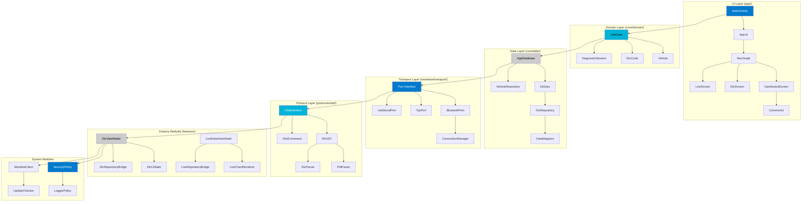
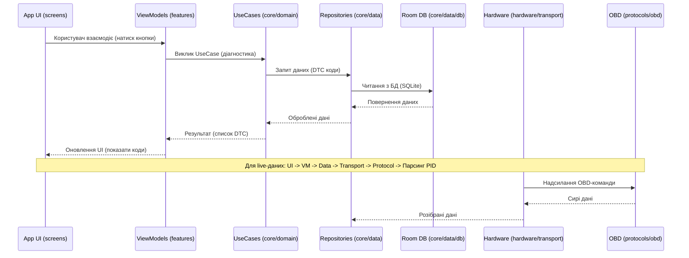
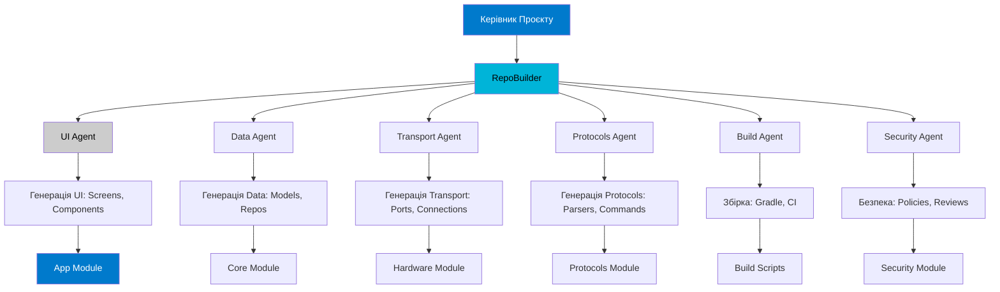

# Архітектурна Візуалізація QuantumForce_Code

## Огляд
Цей документ містить візуальні діаграми архітектури проекту QuantumForce_Code — Android-додатку для AI-підсиленої діагностики автомобілів. Діаграми створені у форматі Mermaid для легкого експорту у SVG/PNG/PDF.

Теми: темний фон (#1e1e1e), акценти синього (#007acc), сірого (#cccccc), бірюзового (#00b4d8). Адаптивна структура для мобільних/десктопних пристроїв.

## 1. Архітектурна Схема Android-Додатку (Розділення: UI, Domain, Data, Transport)



*Пояснення:* Верхній рівень — UI (екрани, навігація). Далі Domain (бізнес-логіка), Data (збереження), Transport (фізичні з'єднання), Protocols (OBD-стандарти), Features (специфічні функції), System (безпека, оновлення). Стрілки показують залежності.

## 2. Структура Директорій з Описами (Tree-Map Стиль)

```mermaid
mindmap
  root((QuantumForce_Code))
    📁 .github
      📁 workflows
        📄 android-ci.yml<br/>CI: збірка, тести
        📄 pr-lint-check.yml<br/>Легкий PR-лінт
        📄 release.yml<br/>Авторелізи
      📄 CODEOWNERS<br/>Власники модулів
      📄 pull_request_template.md<br/>Шаблон PR
      📄 issue_template.md<br/>Шаблон issue
    📁 .devcontainer
      📄 devcontainer.json<br/>Конфіг Codespaces
      📄 Dockerfile<br/>Образ Android SDK
      📄 postCreate.sh<br/>Ініціалізація
    📁 build-logic
      📄 build.gradle.kts<br/>Плагіни збірки
      📄 settings.gradle.kts<br/>Реєстр
      📄 conventions.gradle.kts<br/>Правила
    📁 gradle
      📄 libs.versions.toml<br/>Версії залежностей
      📁 wrapper
        📄 gradle-wrapper.properties<br/>Версія Gradle
        📄 gradle-wrapper.jar<br/>Wrapper бінарник
    📄 settings.gradle.kts<br/>Модулі проєкту
    📄 build.gradle.kts<br/>Коренева збірка
    🧩 app
      📄 build.gradle.kts<br/>Залежності UI
      📁 src/main
        📁 java/com/quantumforce_code/app
          📄 MainActivity.kt<br/>Точка входу
          📄 App.kt<br/>Hilt app
          📁 ui
            📁 screens
              📄 DashboardScreen.kt<br/>Головний екран
              📄 DtcScreen.kt<br/>DTC-екран
              📄 LiveScreen.kt<br/>Live-екран
            📁 components
              📄 CommonUi.kt<br/>UI-компоненти
          📁 navigation
            📄 NavGraph.kt<br/>Навігація
        📁 res<br/>Ресурси Android
        📄 AndroidManifest.xml<br/>Маніфест
      📁 src/test
        📄 AppUiTest.kt<br/>UI-тести
      📁 docs
        📄 ui-agent-guidelines.md<br/>Правила UI
    🧩 core
      📁 domain
        📄 build.gradle.kts<br/>Domain залежності
        📁 src/main/kotlin/com/quantumforce_code/core/domain
          📄 UseCase.kt<br/>Бізнес-операції
          📄 Vehicle.kt<br/>Модель авто
          📄 DtcCode.kt<br/>Модель DTC
          📄 DiagnosticSession.kt<br/>Сесія діагностики
      📁 data
        📄 build.gradle.kts<br/>Data залежності
        📁 src/main/kotlin/com/quantumforce_code/core/data
          📁 db
            📄 AppDatabase.kt<br/>Room DB
            📄 DtcDao.kt<br/>DAO для DTC
          📁 repo
            📄 DtcRepository.kt<br/>Репо DTC
            📄 VehicleRepository.kt<br/>Репо авто
          📄 DataMappers.kt<br/>Мапери моделей
      📁 test
        📄 DataUnitTests.kt<br/>Unit-тести
    🧩 hardware
      📁 transport
        📄 build.gradle.kts<br/>Transport залежності
        📁 src/main/kotlin/com/quantumforce_code/hardware/transport
          📄 Port.kt<br/>Інтерфейс порту
          📄 BluetoothPort.kt<br/>Bluetooth реалізація
          📄 TcpPort.kt<br/>TCP реалізація
          📄 UsbSerialPort.kt<br/>USB реалізація
          📄 ConnectionManager.kt<br/>Менеджер з'єднань
    🧩 protocols
      📁 obd
        📄 build.gradle.kts<br/>OBD залежності
        📁 src/main/kotlin/com/quantumforce_code/protocols/obd
          📄 ObdInterface.kt<br/>OBD інтерфейс
          📄 Elm327.kt<br/>ELM327 адаптер
          📄 ObdCommand.kt<br/>Модель команди
          📄 PidParser.kt<br/>Парсер PID
          📄 DtcParser.kt<br/>Парсер DTC
    🧩 features
      📁 dtc
        📄 build.gradle.kts<br/>DTC залежності
        📁 src/main/kotlin/com/quantumforce_code/features/dtc
          📄 DtcViewModel.kt<br/>VM для DTC
          📄 DtcScreenModel.kt<br/>Модель екрана
          📄 DtcUiState.kt<br/>UI стан
          📄 DtcRepositoryBridge.kt<br/>Міст до даних
      📁 live
        📄 build.gradle.kts<br/>Live залежності
        📁 src/main/kotlin/com/quantumforce_code/features/live
          📄 LiveDataViewModel.kt<br/>VM для live
          📄 LiveChartRenderer.kt<br/>Рендерер графіків
          📄 LiveRepositoryBridge.kt<br/>Міст до даних
    🧩 security
      📄 build.gradle.kts<br/>Security залежності
      📁 src/main/kotlin/com/quantumforce_code/security
        📄 ThreatModel.md<br/>Модель загроз
        📄 SecurityPolicy.kt<br/>Політики безпеки
        📄 LoggerPolicy.kt<br/>Політики логування
    🧩 updates
      📄 build.gradle.kts<br/>Updates залежності
      📁 src/main/kotlin/com/quantumforce_code/updates
        📄 ManifestClient.kt<br/>Клієнт маніфесту
        📄 DataVersion.kt<br/>Модель версій
        📄 UpdateChecker.kt<br/>Перевірка оновлень
        📄 UpdateRepository.kt<br/>Репо оновлень
    🧠 docs
      📄 architecture.md<br/>Архітектура
      📄 roadmap.md<br/>Дорожня карта
      📁 adr
        📄 adr-001-initial-architecture.md<br/>ADR архітектури
      📄 AI_AGENT_ROLE.md<br/>Ролі AI
      📄 SECURITY_POLICY.md<br/>Політика безпеки
      📄 CONTRIBUTING.md<br/>Внесок
      📄 testing-guidelines.md<br/>Тестування
    🤖 prompts
      📄 README.md<br/>Огляд промптів
      📄 ui-agent-start.md<br/>Старт UI
      📄 data-agent-start.md<br/>Старт Data
      📄 protocols-agent-start.md<br/>Старт Protocols
      📄 transport-agent-start.md<br/>Старт Transport
      📄 feature-dtc-start.md<br/>Старт DTC
      📄 feature-live-start.md<br/>Старт Live
      📄 security-review.md<br/>Рев'ю Security
      📄 review-common.md<br/>Загальне рев'ю
      📄 build-agent.md<br/>Старт Build
    ⚙️ scripts
      📄 verify-local.sh<br/>Локальна перевірка
      📄 format-code.sh<br/>Форматування
      📄 run-tests.sh<br/>Запуск тестів
      📄 setup-env.sh<br/>Налаштування
    ⚙️ tests
      📄 integration-test-plan.md<br/>План інтеграції
      📄 unit-tests-report.md<br/>Звіт unit
      📄 ui-tests-report.md<br/>Звіт UI
```



*Пояснення:* Mindmap візуалізує ієрархію директорій з описами. Кожен вузол має іконку та короткий опис. Адаптивна для мобільних (згортання вузлів).

## 3. Потік Даних Між Модулями (Data Flow Diagram)



*Пояснення:* Послідовність показує потік від UI до апаратного шару. Стрілки — виклики, пунктир — відповіді.

## 4. Ролі Агентів у Системі (AI Agents Interaction Chart)



*Пояснення:* Flowchart показує взаємодію агентів. Керівник керує RepoBuilder, який координує спеціалізованих агентів для генерації модулів.

## Автогенерований Фрагмент Коду (Приклад Інтеграції Модулів)

```kotlin
// Приклад інтеграції: DtcViewModel використовує core/data через features/dtc
class DtcViewModel : ViewModel() {
    private val dtcRepository = DtcRepository() // З core/data/repo

    fun loadDtcCodes(): List<DtcCode> {
        return dtcRepository.getDtcCodes() // Виклик до data шару
    }
}
```

*Пояснення:* Цей код демонструє залежність features від core, як у діаграмах вище.

---

Ці візуалізації можна експортувати з Mermaid Live Editor (mermaid.live) у SVG/PNG. Для інтерактивності — додати HTML з JS для згортання вузлів.