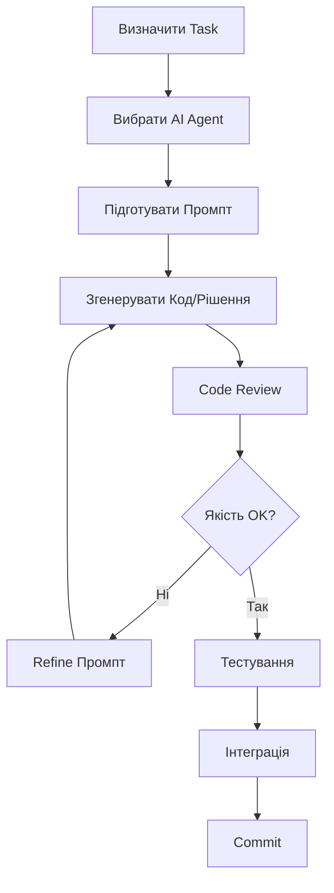

# 🚗 Повний План Розробки Професійного ПЗ для Діагностики Автомобілів
# Complete Guide for Professional Automotive Diagnostic Software Development

[]()
[]()
[]()

---

## 📋 Зміст / Table of Contents

1. [Вступ / Introduction](#вступ--introduction)
2. [Архітектура Системи / System Architecture](#архітектура-системи--system-architecture)
3. [Поетапний План Розробки / Step-by-Step Development Plan](#поетапний-план-розробки--step-by-step-development-plan)
4. [Робота з AI Агентами / Working with AI Agents](#робота-з-ai-агентами--working-with-ai-agents)
5. [Інтеграція Апаратного Забезпечення / Hardware Integration](#інтеграція-апаратного-забезпечення--hardware-integration)
6. [Тестування та Контроль Якості / Testing and Quality Control](#тестування-та-контроль-якості--testing-and-quality-control)
7. [Система Оновлень / Update System](#система-оновлень--update-system)
8. [Бізнес-Модель / Business Model](#бізнес-модель--business-model)

---

## 🎯 Вступ / Introduction

### Мета Проєкту / Project Goal

Створення професійного мультимарочного автосканера нового покоління для Android-планшетів, який:
- ✅ Перевищує функціональність Launch X431 PRO/PRO5
- ✅ Має повну автономність та власне ПЗ
- ✅ Підтримує власні оновлення без залежності від виробників
- ✅ Орієнтований на професійних користувачів
- ✅ Розробляється з використанням AI-агентів

**Creating a next-generation professional multi-brand auto scanner for Android tablets that:**
- ✅ Exceeds Launch X431 PRO/PRO5 functionality
- ✅ Has complete autonomy and proprietary software
- ✅ Supports independent updates without manufacturer dependency
- ✅ Targets professional users
- ✅ Developed using AI agents

---

## 🏗️ Архітектура Системи / System Architecture

### 1. Трьохрівнева Архітектура / Three-Tier Architecture

```
┌─────────────────────────────────────────────────────────────┐
│                    PRESENTATION LAYER                        │
│              (Android UI - Kotlin/Java)                      │
├─────────────────────────────────────────────────────────────┤
│                    BUSINESS LOGIC LAYER                      │
│         (Protocol Handlers, Data Processing, AI)             │
├─────────────────────────────────────────────────────────────┤
│                    DATA ACCESS LAYER                         │
│        (Hardware Interface, Database, Cloud Sync)            │
└─────────────────────────────────────────────────────────────┘
```

### 2. Основні Компоненти / Core Components

#### A. Презентаційний Рівень / Presentation Layer
- **Android Application (Kotlin/Jetpack Compose)**
  - Dashboard з real-time даними
  - Модуль діагностики по марках
  - Інтерфейс кодування/програмування
  - Система звітів та логів
  - Багатомовний інтерфейс (UA/EN/RU/DE/FR)

#### B. Бізнес-Логіка / Business Logic
- **Protocol Handlers**
  - OBD-II (ISO 9141, ISO 14230, ISO 15765)
  - CAN Bus (ISO 11898)
  - DoIP (Diagnostics over IP)
  - UDS (Unified Diagnostic Services - ISO 14229)
  - Manufacturer-specific protocols (VAG, BMW, Mercedes, etc.)

- **AI-Powered Features**
  - Автоматична діагностика несправностей
  - Інтелектуальна інтерпретація кодів помилок
  - Прогнозування поломок
  - Рекомендації по ремонту

#### C. Рівень Даних / Data Layer
- **Local Database (SQLite/Room)**
  - База кодів помилок (50,000+ codes)
  - Діагностичні процедури
  - Історія сканувань
  - Конфігурації транспортних засобів

- **Cloud Integration**
  - Синхронізація даних
  - Система оновлень
  - Телеметрія та аналітика
  - Backup та відновлення

---

## 📝 Поетапний План Розробки / Step-by-Step Development Plan

## ФАЗА 1: ПІДГОТОВКА ТА ДОСЛІДЖЕННЯ (4-6 тижнів)

### Тиждень 1-2: Аналіз та Планування

#### Завдання 1.1: Аналіз Конкурентів
**AI Agent Role:** Research Agent

**Промпт для AI Agent:**
```
Analyze the following automotive diagnostic tools and create a comprehensive feature comparison:
- Launch X431 PRO/PRO5
- Autel MaxiSys Elite
- Snap-on MODIS
- Bosch KTS

Focus on:
1. Supported vehicle protocols
2. Diagnostic capabilities
3. Special functions (coding, programming, adaptations)
4. Hardware specifications
5. Software architecture patterns
6. Update mechanisms
7. Price points and licensing models

Output: Detailed markdown table with feature matrix
```

#### Завдання 1.2: Визначення MVP Features
**Мінімально Необхідний Функціонал:**
- ✅ Читання/очищення кодів помилок (DTC)
- ✅ Live Data моніторинг (PID)
- ✅ Freeze Frame данні
- ✅ Базові тести актуаторів
- ✅ 20+ популярних марок авто
- ✅ OBD-II протоколи
- ✅ Українська/Англійська мови

### Тиждень 3-4: Технічне Проектування

#### Завдання 1.3: Вибір Технологічного Стеку
**Рекомендований Stack:**

**Frontend (Android):**
```kotlin
// build.gradle.kts
dependencies {
    // Jetpack Compose для UI
    implementation("androidx.compose.ui:ui:1.5.4")
    implementation("androidx.compose.material3:material3:1.1.2")
    
    // Navigation
    implementation("androidx.navigation:navigation-compose:2.7.5")
    
    // ViewModel
    implementation("androidx.lifecycle:lifecycle-viewmodel-compose:2.6.2")
    
    // Корутини для асинхронності
    implementation("org.jetbrains.kotlinx:kotlinx-coroutines-android:1.7.3")
    
    // Bluetooth/USB комунікація
    implementation("com.github.mik3y:usb-serial-for-android:3.6.0")
    
    // Database
    implementation("androidx.room:room-runtime:2.6.0")
    implementation("androidx.room:room-ktx:2.6.0")
    
    // Dependency Injection
    implementation("com.google.dagger:hilt-android:2.48")
}
```

**Backend Services:**
```python
# requirements.txt
fastapi==0.104.1          # REST API
uvicorn==0.24.0          # ASGI Server
sqlalchemy==2.0.23       # ORM
alembic==1.12.1          # Database migrations
redis==5.0.1             # Caching
celery==5.3.4            # Task queue
pydantic==2.5.0          # Data validation
python-j1939==2.0.0      # Vehicle protocols
can==4.0.0               # CAN Bus support
```

#### Завдання 1.4: Дизайн Database Schema
**AI Agent Role:** Database Architect

**Промпт для AI Agent:**
```
Design a comprehensive database schema for an automotive diagnostic application with the following requirements:

Entities needed:
1. Vehicle Database (make, model, year, VIN decoder)
2. Diagnostic Trouble Codes (DTC) - 50,000+ codes
3. Parameters/PIDs with formulas
4. Diagnostic Procedures
5. User Sessions and History
6. Vehicle Profiles
7. Software Updates metadata

Requirements:
- Optimized for mobile (SQLite)
- Support for offline operation
- Efficient search and filtering
- Version control for data updates
- Multi-language support

Output: SQL schema with indexes, relationships, and sample queries
```

---

## ФАЗА 2: ПРОТОТИПУВАННЯ (6-8 тижнів)

### Тиждень 5-8: Розробка Core Функціоналу

#### Завдання 2.1: Налаштування Проєкту
**AI Agent Role:** DevOps Agent

**Інструкція для GitHub Copilot:**
```
Create Android project structure for automotive diagnostic app:

/AutoDiagPro
├── app/
│   ├── src/
│   │   ├── main/
│   │   │   ├── java/com/autodiag/
│   │   │   │   ├── ui/              # Jetpack Compose UI
│   │   │   │   ├── domain/          # Business logic
│   │   │   │   ├── data/            # Data layer
│   │   │   │   │   ├── local/       # Room database
│   │   │   │   │   ├── remote/      # API calls
│   │   │   │   │   └── repository/  # Repository pattern
│   │   │   │   ├── hardware/        # Hardware interfaces
│   │   │   │   │   ├── obd/         # OBD protocols
│   │   │   │   │   ├── can/         # CAN Bus
│   │   │   │   │   └── usb/         # USB/Bluetooth
│   │   │   │   └── utils/           # Utilities
│   │   │   └── res/                 # Resources
│   │   └── test/                    # Unit tests
├── backend/                          # Optional cloud backend
│   ├── api/                         # FastAPI services
│   ├── models/                      # Data models
│   └── services/                    # Business services
└── docs/                            # Documentation

Generate:
1. build.gradle.kts with all dependencies
2. Hilt/Dagger setup
3. Room database configuration
4. Navigation graph
5. Base Activity and ViewModels
```

#### Завдання 2.2: Імплементація OBD-II Комунікації
**AI Agent Role:** Protocol Implementation Agent

**Детальний промпт для Claude/GPT-4:**
```
Implement OBD-II communication layer for Android using Kotlin:

Requirements:
1. Support for ELM327-based adapters (Bluetooth/WiFi/USB)
2. Protocol auto-detection (ISO 9141-2, ISO 14230-4, ISO 15765-4, etc.)
3. AT command handling
4. PID request/response parsing
5. DTC reading and clearing
6. Error handling and retry logic
7. Async operations with Kotlin coroutines

Create these classes:
- OBDProtocol enum
- ELM327Connector class
- OBDCommand sealed class
- OBDResponse data class
- OBDRepository interface
- ConnectionManager

Include:
- Complete implementation
- Unit tests
- Usage examples
- Documentation comments
```

**Приклад Коду (Generate by AI):**
```kotlin
// OBDProtocol.kt
sealed class OBDProtocol {
    abstract val identifier: String
    abstract val baudRate: Int
    
    object ISO9141_2 : OBDProtocol() {
        override val identifier = "ISO 9141-2"
        override val baudRate = 10400
    }
    
    object ISO14230_4 : OBDProtocol() {
        override val identifier = "ISO 14230-4 (KWP2000)"
        override val baudRate = 10400
    }
    
    object ISO15765_4_CAN : OBDProtocol() {
        override val identifier = "ISO 15765-4 (CAN)"
        override val baudRate = 500000
    }
}

// ELM327Connector.kt
class ELM327Connector(
    private val ioStream: IOStream,
    private val dispatcher: CoroutineDispatcher = Dispatchers.IO
) {
    private var currentProtocol: OBDProtocol? = null
    
    suspend fun connect(): Result<Boolean> = withContext(dispatcher) {
        try {
            // Reset adapter
            sendCommand("ATZ").getOrThrow()
            delay(1000)
            
            // Turn off echo
            sendCommand("ATE0").getOrThrow()
            
            // Auto protocol detection
            sendCommand("ATSP0").getOrThrow()
            
            // Verify connection with 0100 PID
            val response = sendCommand("0100").getOrThrow()
            
            Result.success(response.isNotEmpty())
        } catch (e: Exception) {
            Result.failure(e)
        }
    }
    
    suspend fun readDTCs(): Result<List<DTC>> = withContext(dispatcher) {
        try {
            val response = sendCommand("03").getOrThrow()
            val dtcs = parseDTCs(response)
            Result.success(dtcs)
        } catch (e: Exception) {
            Result.failure(e)
        }
    }
    
    private suspend fun sendCommand(command: String): Result<String> {
        return try {
            ioStream.write("$command\r")
            val response = ioStream.readUntil(">", timeout = 5000)
            Result.success(response)
        } catch (e: Exception) {
            Result.failure(e)
        }
    }
}
```

### Тиждень 9-12: UI/UX Розробка

#### Завдання 2.3: Дизайн UI/UX
**AI Agent Role:** UI/UX Designer Agent

**Промпт для Figma AI / MidJourney:**
```
Design modern professional automotive diagnostic app interface:

Screens needed:
1. Dashboard - Live vehicle stats (RPM, Speed, Temp, Voltage)
2. DTC Scanner - List of error codes with severity indicators
3. Live Data - Real-time PID monitoring with graphs
4. Vehicle Selection - Brand/Model/Year picker
5. Special Functions - Coding, Adaptations, Tests
6. Reports - PDF generation with charts
7. Settings - Language, Units, Connection

Style requirements:
- Dark theme optimized for garage environment
- High contrast for outdoor visibility
- Large touch targets for gloved hands
- Material Design 3
- Colors: Dark blue (#0D1B2A), Electric blue (#00D9FF), Warning red (#FF6B6B)
- Icons: Automotive-themed, clear, professional

Output: Figma file with all screens and components
```

#### Завдання 2.4: Імплементація UI з Jetpack Compose
**AI Agent Role:** Frontend Developer Agent

**Промпт для Copilot:**
```kotlin
// Generate Jetpack Compose screens for automotive diagnostic app

// 1. Dashboard Screen with live data
@Composable
fun DashboardScreen(viewModel: DashboardViewModel) {
    // Show 4 main gauges: RPM, Speed, Coolant Temp, Battery Voltage
    // Include status indicators for engine, transmission, ABS, airbag
    // Bottom section: Quick actions (Scan, Clear DTC, Live Data)
}

// 2. DTC Scanner Screen
@Composable
fun DTCScreen(viewModel: DTCViewModel) {
    // Top: Scan button with progress indicator
    // List of DTCs with:
    //   - Code (P0420)
    //   - Description
    //   - Status (Confirmed/Pending)
    //   - Severity indicator
    // Actions: Clear codes, View details, Generate report
}

// 3. Live Data Screen with real-time graphs
@Composable
fun LiveDataScreen(viewModel: LiveDataViewModel) {
    // Top: Auto-refresh toggle, refresh rate selector
    // Scrollable list of PIDs with current values
    // Tap PID to show graph
    // Support multiple simultaneous graphs
}

Requirements:
- Use Material 3 components
- Dark theme
- Proper state management with ViewModel
- Loading/Error states
- Smooth animations
- Accessibility support
```

---

## ФАЗА 3: РОЗШИРЕНИЙ ФУНКЦІОНАЛ (8-10 тижнів)

### Тиждень 13-16: Manufacturer-Specific Features

#### Завдання 3.1: Імплементація VAG Protocol
**AI Agent Role:** Automotive Protocol Specialist

**Промпт для AI Agent:**
```
Implement Volkswagen Audi Group (VAG) diagnostic protocol:

Requirements:
1. KWP2000 protocol support
2. Control module identification
3. Coding/Long coding
4. Adaptations
5. Basic settings
6. Component testing
7. Security access (login codes)

Supported modules:
- Engine (01)
- Transmission (02)
- ABS (03)
- Airbag (15)
- Instrument cluster (17)
- Central convenience (46)

Create:
- VAGProtocol class
- ControlModule data class
- CodingHelper utility
- Sample data for Golf Mk7

Include detailed comments and error handling
```

#### Завдання 3.2: AI-Powered Diagnostics
**AI Agent Role:** Machine Learning Engineer

**Промпт для AI Agent:**
```
Design AI diagnostic assistant using LangGraph:

Features:
1. Symptom-to-cause analysis
2. DTC interpretation with context
3. Repair recommendations
4. Cost estimation
5. Required tools/parts suggestions
6. Step-by-step repair guides

Implementation:
- Use RAG (Retrieval Augmented Generation)
- Knowledge base: Service manuals, TSBs, common fixes
- Multi-language support
- Offline capability with cached responses

Architecture:
- Vector database for repair knowledge (Chroma/Pinecone)
- LLM for reasoning (GPT-4/Claude-3)
- Local embedding model for offline mode
- Feedback loop for continuous improvement

Provide:
- Python implementation
- Integration with Android app via REST API
- Sample knowledge base
- Evaluation metrics
```

**Приклад Інтеграції:**
```python
# backend/services/ai_diagnostics.py
from langchain.agents import AgentExecutor, create_react_agent
from langchain.tools import Tool
from langchain_community.vectorstores import Chroma
from langchain_openai import ChatOpenAI, OpenAIEmbeddings

class AutomotiveDiagnosticAgent:
    def __init__(self):
        self.embeddings = OpenAIEmbeddings()
        self.vectorstore = Chroma(
            persist_directory="./knowledge_base",
            embedding_function=self.embeddings
        )
        self.llm = ChatOpenAI(model="gpt-4-turbo-preview", temperature=0)
        
        self.tools = [
            Tool(
                name="DTC_Lookup",
                func=self.lookup_dtc,
                description="Look up diagnostic trouble code details"
            ),
            Tool(
                name="Repair_Procedure",
                func=self.get_repair_procedure,
                description="Get step-by-step repair procedure"
            ),
            Tool(
                name="Parts_Lookup",
                func=self.lookup_parts,
                description="Find required parts and costs"
            )
        ]
        
        self.agent = create_react_agent(self.llm, self.tools, self.prompt_template)
        self.executor = AgentExecutor(agent=self.agent, tools=self.tools)
    
    async def diagnose(self, vehicle_info: dict, dtcs: list, symptoms: str):
        """
        Perform comprehensive diagnostic analysis
        """
        query = f"""
        Vehicle: {vehicle_info['make']} {vehicle_info['model']} {vehicle_info['year']}
        DTCs: {', '.join(dtcs)}
        Symptoms: {symptoms}
        
        Provide:
        1. Root cause analysis
        2. Recommended repairs (prioritized)
        3. Estimated cost and time
        4. Required tools and parts
        5. Difficulty level
        """
        
        result = await self.executor.ainvoke({"input": query})
        return result
    
    def lookup_dtc(self, code: str) -> str:
        """Retrieve DTC information from knowledge base"""
        docs = self.vectorstore.similarity_search(f"DTC {code}", k=3)
        return "\n".join([doc.page_content for doc in docs])
```

### Тиждень 17-20: Special Functions

#### Завдання 3.3: Coding & Programming
**Компоненти для Реалізації:**

1. **ECU Coding**
   - Binary/Hex editors
   - Checksum calculators
   - Backup/Restore functions
   - Template-based coding helper

2. **Component Programming**
   - Key programming
   - Injector coding
   - Throttle body adaptation
   - Module replacement procedures

3. **Immobilizer Functions**
   - Key learning
   - PIN code reading
   - EEPROM programming
   - Transponder operations

**AI Agent для Генерації Безпечного Коду:**
```
Generate secure coding module for automotive ECU programming:

Safety requirements:
- Mandatory backup before any write operation
- Verification after programming
- Rollback capability
- User confirmation for critical operations
- Logging all changes
- VIN verification

Include:
- Write protection mechanisms
- Timeout handling
- Progress monitoring
- Error recovery procedures
- Audit trail

Provide complete implementation with tests
```

---

## ФАЗА 4: ІНТЕГРАЦІЯ ТА ТЕСТУВАННЯ (6-8 тижнів)

### Тиждень 21-24: Hardware Integration

#### Завдання 4.1: Розробка/Вибір Hardware Adapter

**Варіант 1: Використання Готових Адаптерів**
```
Рекомендовані адаптери:
1. OBDLink MX+ (Bluetooth, multi-protocol)
2. VINT-TT5 (USB, VAG-specific)
3. Autel VCI (WiFi, professional grade)
4. Custom ESP32-based (DIY option)
```

**Варіант 2: Розробка Власного Адаптера**

**AI Agent Role:** Hardware Engineer

**Промпт для AI Agent:**
```
Design custom OBD-II adapter based on ESP32:

Specifications:
- MCU: ESP32-WROVER
- CAN Transceiver: MCP2551
- K-Line Interface: MC33290
- Power: Automotive-grade DC-DC converter
- Connectivity: Bluetooth 5.0, WiFi
- Protection: Reverse polarity, ESD, overvoltage

Deliverables:
1. Schematic diagram
2. PCB layout (KiCad)
3. BOM with suppliers
4. Firmware in C++ (Arduino/ESP-IDF)
5. Communication protocol specification
6. Production cost estimate

Output format: Complete hardware package with documentation
```

#### Завдання 4.2: Тестування на Реальних Автомобілях

**Тест-План:**

| Марка | Модель | Рік | Протокол | Тести |
|-------|--------|-----|----------|-------|
| VW | Golf | 2015-2020 | CAN/KWP2000 | DTC, Live Data, Coding, Adaptations |
| BMW | 3 Series | 2012-2018 | CAN/ENET | DTC, Live Data, Coding, Programming |
| Mercedes | C-Class | 2014-2021 | DoIP | DTC, Live Data, SCN Coding |
| Toyota | Corolla | 2016-2023 | CAN | DTC, Live Data, Service Resets |
| Ford | Focus | 2015-2022 | CAN/MS-CAN | DTC, Live Data, Module Programming |

**AI Agent для Генерації Тест-Кейсів:**
```
Generate comprehensive test cases for automotive diagnostic software:

For each vehicle:
1. Connection test
2. DTC read/clear (all modules)
3. Live data verification (20+ PIDs)
4. Freeze frame retrieval
5. Readiness monitors
6. O2 sensor tests
7. Evap system tests
8. Actuator tests
9. Special functions (if supported)

Include:
- Expected results
- Pass/fail criteria
- Performance benchmarks
- Edge cases
- Error scenarios

Output: Detailed test plan in markdown with automation scripts
```

### Тиждень 25-28: System Testing & Optimization

#### Завдання 4.3: Performance Testing
```python
# Performance benchmarks to meet:

PERFORMANCE_TARGETS = {
    "app_launch_time": "< 2 seconds",
    "connection_establishment": "< 5 seconds",
    "dtc_scan_all_modules": "< 30 seconds",
    "live_data_refresh_rate": "> 10 Hz",
    "database_query": "< 100ms",
    "ui_frame_rate": "> 60 FPS",
    "memory_usage": "< 500 MB",
    "battery_consumption": "< 5% per hour",
    "storage_size": "< 2 GB"
}
```

**AI Agent для Optimization:**
```
Analyze and optimize Android app performance:

Areas to optimize:
1. Database queries (add indexes, optimize schemas)
2. UI rendering (lazy loading, view recycling)
3. Network calls (caching, batching)
4. Memory management (leak detection, proper lifecycle)
5. Battery usage (background restrictions, wake locks)
6. APK size (ProGuard, resource optimization)

Tools to use:
- Android Profiler
- LeakCanary
- StrictMode
- Baseline Profiles

Provide:
- Performance analysis report
- Optimization recommendations
- Implementation of top 10 improvements
- Before/after metrics
```

---

## 🤖 Робота з AI Агентами / Working with AI Agents

### Стратегія Використання AI Агентів

### 1. Тип Агентів та їх Ролі

#### A. Architecture Agent (Claude-3 Opus / GPT-4)
**Спеціалізація:** Проектування архітектури, технічні рішення
**Використання:** Стартова фаза, критичні технічні рішення

**Шаблон Промпту:**
```
Role: Senior Software Architect specializing in automotive software

Context: Designing {component_name} for professional automotive diagnostic application

Requirements:
- {list_of_requirements}

Constraints:
- {list_of_constraints}

Expected output:
1. Architecture diagram (Mermaid)
2. Component descriptions
3. Interface definitions
4. Technology recommendations
5. Risk assessment

Format: Detailed technical specification document
```

#### B. Code Generation Agent (GitHub Copilot / Codex)
**Спеціалізація:** Генерація коду, auto-completion
**Використання:** Щоденна розробка, boilerplate code

**Шаблон для Copilot Chat:**
```
@workspace /new Generate {component_name} following these requirements:

1. Functionality: {describe_what_it_does}
2. Input: {describe_inputs}
3. Output: {describe_outputs}
4. Error handling: {error_scenarios}
5. Tests: {test_requirements}

Style guide: Follow Google Kotlin style guide
Documentation: Include KDoc comments
Performance: Optimize for mobile
```

#### C. Protocol Expert Agent (Specialized Model)
**Спеціалізація:** Automotive protocols, ECU communication
**Використання:** Імплементація специфічних протоколів

**Приклад Запиту:**
```
Expert system prompt:

You are an automotive diagnostic protocol expert with 20 years of experience in:
- OBD-II standards
- CAN Bus protocols
- UDS (ISO 14229)
- KWP2000
- Manufacturer-specific protocols (VAG, BMW, etc.)

Task: Implement {protocol_name} for {vehicle_make}

Provide:
1. Protocol specification summary
2. Message structure
3. Complete implementation
4. Test cases
5. Known issues and workarounds

Reference: ISO standards, SAE J standards
```

#### D. Testing Agent (Test Generation AI)
**Спеціалізація:** Генерація тестів, QA automation
**Використання:** Unit tests, integration tests, E2E tests

**Промпт для Генерації Тестів:**
```
Generate comprehensive test suite for {class_name}:

Test types needed:
1. Unit tests (JUnit 5)
2. Integration tests
3. UI tests (Compose testing)
4. Edge cases
5. Error scenarios

Coverage target: > 85%
Mocking: Use MockK
Assertions: Use Truth library

For each test:
- Given/When/Then format
- Clear test names
- Proper setup/teardown
- Parameterized tests where applicable

Include performance and security tests
```

### 2. Workflow з AI Агентами

#### Щоденний Workflow:



#### Приклад Сесії з AI Agent:

**Task: Імплементувати BMW Coding**

**Крок 1: Дослідження (Claude-3)**
```
Research prompt:

Analyze BMW coding system for F-series vehicles:
1. Coding methods (FSC, FDL, etc.)
2. Security and authentication
3. Data format and structure
4. Tools and protocols used
5. Common procedures

Output: Technical specification document
```

**Крок 2: Design (GPT-4)**
```
Design prompt:

Based on the research, design BMW coding module:

Components:
- CodingManager class
- BMWAuthentication service
- FSCGenerator utility
- VINValidator

Patterns: Repository, Strategy, Factory
Dependencies: {list_dependencies}

Output: UML diagrams + interface definitions
```

**Крок 3: Implementation (Copilot)**
```kotlin
// In IDE with Copilot
// Start typing with clear intent comments:

// BMW Coding Manager following BMW F-series specification
// Supports FSC codes, authentication, and validation
class BMWCodingManager {
    // Copilot will autocomplete...
}
```

**Крок 4: Testing (Test Generation AI)**
```
Generate tests prompt:

Create test suite for BMWCodingManager covering:
1. Authentication success/failure
2. FSC code generation
3. VIN validation
4. Error handling
5. Mock BMW ECU responses

Framework: JUnit 5 + MockK
```

**Крок 5: Documentation (GPT-4)**
```
Documentation prompt:

Generate user documentation for BMW coding feature:

Audience: Professional mechanics
Sections:
1. Overview
2. Prerequisites
3. Step-by-step procedure
4. Troubleshooting
5. Safety warnings
6. FAQ

Format: Markdown with screenshots
```

### 3. Шаблони для Різних Задач

#### Template 1: Feature Implementation
```markdown
# Feature: {Feature Name}

## Context
- User story: {description}
- Acceptance criteria: {list}

## AI Agent Task

**Phase 1: Analysis**
Agent: {Agent Name}
Prompt: """
{detailed_requirements}
"""

**Phase 2: Design**
Agent: {Agent Name}
Prompt: """
{design_requirements}
"""

**Phase 3: Implementation**
Agent: {Agent Name}
Prompt: """
{implementation_requirements}
"""

**Phase 4: Testing**
Agent: {Agent Name}
Prompt: """
{testing_requirements}
"""

## Validation Checklist
- [ ] Meets acceptance criteria
- [ ] Code review passed
- [ ] Tests passing (coverage > 80%)
- [ ] Documentation updated
- [ ] Performance benchmarks met
```

#### Template 2: Bug Fix
```markdown
# Bug Fix: {Bug Description}

## Problem
- Symptom: {what_happens}
- Expected: {what_should_happen}
- Logs: {error_logs}

## AI Agent Task

**Step 1: Root Cause Analysis**
Agent: Debugging Agent
Prompt: """
Analyze the following error and identify root cause:

Code context: {relevant_code}
Error: {error_message}
Stack trace: {stack_trace}
Conditions: {reproduction_steps}

Provide:
1. Root cause explanation
2. Affected components
3. Fix recommendations
4. Prevention strategies
"""

**Step 2: Fix Implementation**
Agent: Code Generation Agent
Prompt: """
Implement fix for {bug_description}:

Root cause: {identified_cause}
Files to modify: {file_list}
Requirements: {fix_requirements}

Ensure:
- Backward compatibility
- No side effects
- Proper error handling
- Add regression test
"""

## Verification
- [ ] Bug reproduced
- [ ] Fix implemented
- [ ] Regression test added
- [ ] Manual testing passed
- [ ] Code reviewed
```

### 4. Best Practices для AI-Assisted Development

#### ✅ DO's:
1. **Будь Конкретним** - Деталізовані промпти дають кращі результати
2. **Ітеруй** - Поліпшуй промпти на основі результатів
3. **Валідуй** - Завжди перевіряй згенерований код
4. **Документуй** - Зберігай успішні промпти для повторного використання
5. **Тестуй** - AI може робити помилки, тести обов'язкові
6. **Навчайся** - Розумій згенерований код, не просто копіюй

#### ❌ DON'Ts:
1. **Не Довіряй Сліпо** - AI може галюцинувати факти
2. **Не Ігноруй Security** - Перевіряй на вразливості
3. **Не Копіюй Без Розуміння** - Розумій кожен рядок коду
4. **Не Забувай про Edge Cases** - AI часто пропускає граничні випадки
5. **Не Нехтуй Code Review** - Людська перевірка критична
6. **Не Використовуй для Критичних Рішень** - Фінальні рішення - за людиною

---

## 🔧 Інтеграція Апаратного Забезпечення / Hardware Integration

### Hardware Requirements

#### Мінімальні Вимоги до Планшету:
```yaml
Android Tablet Specifications:
  OS: Android 11+ (API 30+)
  CPU: Octa-core 2.0 GHz+
  RAM: 4 GB minimum, 8 GB recommended
  Storage: 64 GB minimum
  Screen: 10" minimum, bright (500+ nits)
  Connectivity:
    - Bluetooth 5.0+
    - USB Type-C with OTG
    - WiFi 802.11ac
  Battery: 6000+ mAh
  Extras:
    - IP54 rating (dust/water resistant)
    - Rubberized case
    - Stylus support
```

#### Рекомендовані Планшети:
1. Samsung Galaxy Tab Active4 Pro (rugged, professional)
2. Lenovo Tab P11 Pro (good performance/price)
3. Huawei MatePad 11 (good hardware)

### Adapter Hardware Options

#### Опція 1: OBDLink MX+ (Ready-made)
```
Pros:
+ Готовий до використання
+ Надійний, перевірений
+ Хороша документація
+ Multi-protocol підтримка

Cons:
- Вартість ($100+)
- Обмежені можливості кастомізації
- Залежність від виробника

Integration:
- Bluetooth SPP профіль
- AT команди через серійний порт
```

#### Опція 2: Custom ESP32-based Adapter
**AI Agent для Розробки:**

```
Design custom diagnostic adapter:

Hardware:
- MCU: ESP32-WROVER-E (WiFi + BT)
- CAN: MCP2515 + MCP2551
- K-Line: L9637D
- J1850: J1850 transceiver
- Power: LM2596 buck converter
- USB: CH340G USB-UART

Features:
- Multi-protocol support
- Over-the-air updates
- Built-in logging
- LED indicators
- Low power mode

Firmware features:
- AT command compatibility
- WiFi AP mode for direct connection
- BLE for low-power scenarios
- DTC snapshot capture
- Buffered communication

Deliverables:
1. Schematic (KiCad)
2. PCB layout
3. BOM with DigiKey part numbers
4. Firmware (Arduino/ESP-IDF)
5. 3D printable enclosure
6. Assembly instructions
7. Cost analysis

Target cost: < $50 for components
```

**Приклад Firmware (ESP32):**
```cpp
// esp32_obd_adapter.ino
#include <BluetoothSerial.h>
#include <WiFi.h>
#include <CAN.h>

BluetoothSerial SerialBT;

// CAN Bus Configuration
#define CAN_TX_PIN 5
#define CAN_RX_PIN 4
#define CAN_SPEED 500E3  // 500 kbps

// K-Line Configuration
#define KLINE_TX_PIN 17
#define KLINE_RX_PIN 16

// Protocol enum
enum OBDProtocol {
    AUTO_DETECT = 0,
    ISO9141 = 3,
    KWP2000 = 4,
    CAN_11B_500K = 6,
    CAN_29B_500K = 7
};

OBDProtocol currentProtocol = AUTO_DETECT;

void setup() {
    Serial.begin(115200);
    SerialBT.begin("AutoDiagPro_BT");
    
    // Initialize CAN
    CAN.setPins(CAN_RX_PIN, CAN_TX_PIN);
    if (!CAN.begin(CAN_SPEED)) {
        Serial.println("CAN init failed!");
    }
    
    Serial.println("AutoDiagPro Adapter Ready");
}

void loop() {
    // Handle Bluetooth commands
    if (SerialBT.available()) {
        String command = SerialBT.readStringUntil('\r');
        handleCommand(command);
    }
    
    // Handle CAN messages
    if (CAN.parsePacket()) {
        handleCANMessage();
    }
}

void handleCommand(String cmd) {
    cmd.trim();
    
    if (cmd.startsWith("AT")) {
        handleATCommand(cmd);
    } else {
        handleOBDCommand(cmd);
    }
}

void handleATCommand(String cmd) {
    if (cmd == "ATZ") {
        // Reset adapter
        SerialBT.println("ELM327 v2.2 Compatible");
    } else if (cmd == "ATSP0") {
        // Auto protocol
        currentProtocol = AUTO_DETECT;
        SerialBT.println("OK");
    } else if (cmd.startsWith("ATSP")) {
        // Set protocol
        int protocol = cmd.substring(4).toInt();
        currentProtocol = (OBDProtocol)protocol;
        SerialBT.println("OK");
    } else if (cmd == "ATE0") {
        // Echo off
        SerialBT.println("OK");
    } else {
        SerialBT.println("?");
    }
    
    SerialBT.print(">");
}

void handleOBDCommand(String cmd) {
    // Parse OBD command (e.g., "01 00", "03")
    String response = "";
    
    if (currentProtocol == CAN_11B_500K || currentProtocol == CAN_29B_500K) {
        response = sendCANQuery(cmd);
    } else if (currentProtocol == ISO9141 || currentProtocol == KWP2000) {
        response = sendKLineQuery(cmd);
    }
    
    SerialBT.println(response);
    SerialBT.print(">");
}

String sendCANQuery(String cmd) {
    // Convert command to CAN frame
    // Send and wait for response
    // Parse response
    // Return formatted string
    
    // Example for PID 01 00
    if (cmd == "0100") {
        // Mock response - in real implementation, send/receive via CAN
        return "41 00 BE 3E B8 11";
    }
    
    return "NO DATA";
}

String sendKLineQuery(String cmd) {
    // Implement K-Line communication
    // ISO 9141-2 or KWP2000 protocol
    return "NO DATA";
}

void handleCANMessage() {
    int packetId = CAN.packetId();
    int packetLength = CAN.packetDlc();
    
    // Process incoming CAN messages
    uint8_t data[8];
    for (int i = 0; i < packetLength; i++) {
        data[i] = CAN.read();
    }
    
    // Forward to app if needed
}
```

### Android App - Hardware Communication

```kotlin
// hardware/bluetooth/BluetoothManager.kt
class BluetoothManager @Inject constructor(
    private val context: Context
) {
    private val bluetoothAdapter: BluetoothAdapter? = BluetoothAdapter.getDefaultAdapter()
    private var bluetoothSocket: BluetoothSocket? = null
    private var inputStream: InputStream? = null
    private var outputStream: OutputStream? = null
    
    suspend fun connect(deviceAddress: String): Result<Boolean> = withContext(Dispatchers.IO) {
        try {
            val device = bluetoothAdapter?.getRemoteDevice(deviceAddress)
            val uuid = UUID.fromString("00001101-0000-1000-8000-00805F9B34FB") // SPP UUID
            
            bluetoothSocket = device?.createRfcommSocketToServiceRecord(uuid)
            bluetoothSocket?.connect()
            
            inputStream = bluetoothSocket?.inputStream
            outputStream = bluetoothSocket?.outputStream
            
            Result.success(true)
        } catch (e: IOException) {
            Result.failure(e)
        }
    }
    
    suspend fun sendCommand(command: String): Result<String> = withContext(Dispatchers.IO) {
        try {
            outputStream?.write("$command\r".toByteArray())
            outputStream?.flush()
            
            val response = readResponse()
            Result.success(response)
        } catch (e: IOException) {
            Result.failure(e)
        }
    }
    
    private fun readResponse(timeoutMs: Long = 5000): String {
        val buffer = ByteArray(1024)
        val response = StringBuilder()
        val startTime = System.currentTimeMillis()
        
        while (System.currentTimeMillis() - startTime < timeoutMs) {
            if (inputStream?.available() ?: 0 > 0) {
                val bytesRead = inputStream?.read(buffer) ?: 0
                val data = String(buffer, 0, bytesRead)
                response.append(data)
                
                if (data.contains(">")) {
                    break
                }
            }
            Thread.sleep(10)
        }
        
        return response.toString().trim()
    }
    
    fun disconnect() {
        try {
            inputStream?.close()
            outputStream?.close()
            bluetoothSocket?.close()
        } catch (e: IOException) {
            e.printStackTrace()
        }
    }
}

// Usage in ViewModel
class DiagnosticsViewModel @Inject constructor(
    private val bluetoothManager: BluetoothManager,
    private val obdRepository: OBDRepository
) : ViewModel() {
    
    private val _connectionState = MutableStateFlow<ConnectionState>(ConnectionState.Disconnected)
    val connectionState: StateFlow<ConnectionState> = _connectionState.asStateFlow()
    
    fun connectToAdapter(deviceAddress: String) {
        viewModelScope.launch {
            _connectionState.value = ConnectionState.Connecting
            
            val result = bluetoothManager.connect(deviceAddress)
            result.onSuccess {
                _connectionState.value = ConnectionState.Connected
                initializeConnection()
            }.onFailure {
                _connectionState.value = ConnectionState.Error(it.message ?: "Connection failed")
            }
        }
    }
    
    private suspend fun initializeConnection() {
        // Reset adapter
        bluetoothManager.sendCommand("ATZ")
        delay(1000)
        
        // Configure adapter
        bluetoothManager.sendCommand("ATE0")
        bluetoothManager.sendCommand("ATSP0")
        
        // Verify connection
        val result = bluetoothManager.sendCommand("0100")
        if (result.isSuccess) {
            Log.d("Diagnostics", "Adapter ready: ${result.getOrNull()}")
        }
    }
}
```

---

## 🧪 Тестування та Контроль Якості / Testing and Quality Control

### Стратегія Тестування

#### 1. Unit Testing (85%+ coverage)

**AI Agent для Генерації Тестів:**
```
Generate comprehensive unit tests for {ClassName}:

Framework: JUnit 5 + MockK
Style: Given-When-Then
Coverage target: > 85%

For each public method:
1. Happy path test
2. Edge cases (null, empty, boundary values)
3. Error scenarios
4. Performance tests (if applicable)

Include:
- Parameterized tests for multiple inputs
- Proper mocking of dependencies
- Assertion messages
- Test data builders

Example:
```kotlin
class OBDRepositoryTest {
    @Test
    fun `readDTCs should return list of DTCs when connection is successful`() {
        // Given
        val mockConnection = mockk<OBDConnection>()
        every { mockConnection.sendCommand("03") } returns "43 01 P0420 P0171"
        val repository = OBDRepository(mockConnection)
        
        // When
        val result = runBlocking { repository.readDTCs() }
        
        // Then
        assertThat(result.isSuccess).isTrue()
        assertThat(result.getOrNull()).hasSize(2)
        assertThat(result.getOrNull()?.first()?.code).isEqualTo("P0420")
    }
}
```
```

#### 2. Integration Testing

**Тести Інтеграції з Hardware:**
```kotlin
@RunWith(AndroidJUnit4::class)
class HardwareIntegrationTest {
    
    @Before
    fun setup() {
        // Requires real hardware adapter connected
        assumeTrue("Hardware adapter not found", isAdapterConnected())
    }
    
    @Test
    fun testFullDiagnosticsCycle() = runTest {
        // Connect
        val connected = connectToAdapter()
        assertThat(connected).isTrue()
        
        // Read DTCs
        val dtcs = readDTCs()
        assertThat(dtcs).isNotNull()
        
        // Read live data
        val liveData = readPID(PID.ENGINE_RPM)
        assertThat(liveData).isGreaterThan(0)
        
        // Disconnect
        disconnect()
    }
}
```

#### 3. UI Testing (Jetpack Compose)

```kotlin
@OptIn(ExperimentalTestApi::class)
class DashboardScreenTest {
    
    @get:Rule
    val composeTestRule = createAndroidComposeRule<MainActivity>()
    
    @Test
    fun dashboardDisplaysLiveData() {
        composeTestRule.setContent {
            DashboardScreen(
                viewModel = FakeDashboardViewModel()
            )
        }
        
        // Verify RPM gauge is displayed
        composeTestRule
            .onNodeWithText("RPM")
            .assertIsDisplayed()
        
        // Verify values update
        composeTestRule
            .onNodeWithText("2500")
            .assertIsDisplayed()
    }
}
```

#### 4. Performance Testing

```kotlin
class PerformanceTest {
    
    @Test
    fun measureDatabaseQueryPerformance() {
        val benchmark = measureTimeMillis {
            repeat(1000) {
                database.dtcDao().searchByCode("P0%")
            }
        }
        
        assertThat(benchmark / 1000).isLessThan(100) // < 100ms average
    }
    
    @Test
    fun measureUIRenderingPerformance() {
        // Use Android Benchmark library
        // Measure frame rendering time
        // Assert < 16ms per frame (60 FPS)
    }
}
```

### Quality Gates

```yaml
Quality Requirements:
  Code Coverage:
    Unit Tests: ">= 85%"
    Integration Tests: ">= 70%"
    Overall: ">= 80%"
  
  Code Quality:
    Complexity: "< 10 (cyclomatic)"
    Duplication: "< 5%"
    Code Smells: "0 critical"
    Vulnerabilities: "0"
    
  Performance:
    App Launch: "< 2s"
    Memory: "< 500MB"
    Battery: "< 5% per hour"
    APK Size: "< 150MB"
    
  Accessibility:
    WCAG Level: "AA"
    Touch Targets: ">= 48dp"
    Contrast Ratio: ">= 4.5:1"
```

### Continuous Integration Pipeline

```yaml
# .github/workflows/ci.yml
name: CI Pipeline

on:
  push:
    branches: [ main, develop ]
  pull_request:
    branches: [ main, develop ]

jobs:
  build:
    runs-on: ubuntu-latest
    
    steps:
      - uses: actions/checkout@v3
      
      - name: Set up JDK 17
        uses: actions/setup-java@v3
        with:
          java-version: '17'
          distribution: 'temurin'
          
      - name: Build with Gradle
        run: ./gradlew build
        
      - name: Run Unit Tests
        run: ./gradlew test
        
      - name: Run Lint
        run: ./gradlew lint
        
      - name: Code Coverage
        run: ./gradlew jacocoTestReport
        
      - name: Upload Coverage to Codecov
        uses: codecov/codecov-action@v3
        
      - name: Static Analysis
        run: ./gradlew detekt
        
      - name: Security Scan
        run: ./gradlew dependencyCheckAnalyze

  ui-test:
    runs-on: macos-latest
    
    steps:
      - uses: actions/checkout@v3
      
      - name: Run Instrumented Tests
        uses: reactivecircus/android-emulator-runner@v2
        with:
          api-level: 33
          script: ./gradlew connectedCheck
```

---

## 🔄 Система Оновлень / Update System

### Architecture

```
┌─────────────────┐         ┌──────────────────┐
│  Android App    │◄────────┤  Update Server   │
│                 │  HTTPS  │  (FastAPI)       │
└─────────────────┘         └──────────────────┘
         │                           │
         │                           │
         ▼                           ▼
┌─────────────────┐         ┌──────────────────┐
│  Local Database │         │  CDN Storage     │
│  (SQLite)       │         │  (AWS S3)        │
└─────────────────┘         └──────────────────┘
```

### Update Types

1. **App Updates** - Через Google Play або APK
2. **Data Updates** - DTCs, PIDs, Procedures
3. **Vehicle Updates** - Нові моделі, протоколи
4. **Firmware Updates** - Для hardware adapter

### Implementation

```python
# backend/api/updates.py
from fastapi import FastAPI, HTTPException, Depends
from pydantic import BaseModel
from typing import List, Optional
import hashlib

app = FastAPI()

class UpdatePackage(BaseModel):
    id: str
    type: str  # "dtc", "vehicle", "procedure", "firmware"
    version: str
    size: int
    checksum: str
    url: str
    release_date: str
    mandatory: bool
    description: str

class UpdateRequest(BaseModel):
    app_version: str
    data_version: str
    vehicle_databases: List[str]
    device_id: str

@app.post("/api/v1/updates/check")
async def check_updates(request: UpdateRequest) -> List[UpdatePackage]:
    """
    Check for available updates
    """
    available_updates = []
    
    # Check data updates
    if is_data_update_available(request.data_version):
        update = get_data_update(request.data_version)
        available_updates.append(update)
    
    # Check vehicle database updates
    for vehicle_db in request.vehicle_databases:
        if is_vehicle_update_available(vehicle_db):
            update = get_vehicle_update(vehicle_db)
            available_updates.append(update)
    
    return available_updates

@app.get("/api/v1/updates/download/{update_id}")
async def download_update(update_id: str):
    """
    Get signed URL for update download
    """
    update = get_update_by_id(update_id)
    if not update:
        raise HTTPException(status_code=404, detail="Update not found")
    
    # Generate temporary signed URL (S3 presigned URL)
    signed_url = generate_signed_url(update.file_path, expires_in=3600)
    
    return {"url": signed_url, "checksum": update.checksum}

@app.post("/api/v1/updates/verify")
async def verify_update(update_id: str, checksum: str):
    """
    Verify downloaded update integrity
    """
    update = get_update_by_id(update_id)
    return {"valid": update.checksum == checksum}
```

```kotlin
// data/repository/UpdateRepository.kt
class UpdateRepository @Inject constructor(
    private val updateApi: UpdateApi,
    private val downloadManager: DownloadManager,
    private val database: AppDatabase
) {
    
    suspend fun checkForUpdates(): Result<List<UpdatePackage>> {
        val request = UpdateRequest(
            appVersion = BuildConfig.VERSION_NAME,
            dataVersion = getDataVersion(),
            vehicleDatabases = getInstalledVehicleDBs(),
            deviceId = getDeviceId()
        )
        
        return try {
            val updates = updateApi.checkUpdates(request)
            Result.success(updates)
        } catch (e: Exception) {
            Result.failure(e)
        }
    }
    
    suspend fun downloadUpdate(update: UpdatePackage): Flow<DownloadProgress> = flow {
        // Get download URL
        val urlResponse = updateApi.getDownloadUrl(update.id)
        
        // Download with progress
        val file = downloadManager.downloadFile(
            url = urlResponse.url,
            destinationDir = getUpdateDirectory()
        )
        
        file.collect { progress ->
            emit(progress)
        }
        
        // Verify checksum
        val downloadedChecksum = calculateChecksum(progress.file)
        if (downloadedChecksum != update.checksum) {
            throw SecurityException("Checksum verification failed")
        }
        
        emit(DownloadProgress.Completed(progress.file))
    }
    
    suspend fun installUpdate(update: UpdatePackage, file: File): Result<Boolean> {
        return try {
            when (update.type) {
                "dtc" -> installDTCUpdate(file)
                "vehicle" -> installVehicleUpdate(file)
                "procedure" -> installProcedureUpdate(file)
                "firmware" -> installFirmwareUpdate(file)
                else -> throw IllegalArgumentException("Unknown update type")
            }
            
            // Update version in database
            updateDataVersion(update.type, update.version)
            
            Result.success(true)
        } catch (e: Exception) {
            Result.failure(e)
        }
    }
    
    private suspend fun installDTCUpdate(file: File) {
        // Parse update file (JSON/SQLite)
        val dtcs = parseDTCUpdate(file)
        
        // Update database in transaction
        database.withTransaction {
            database.dtcDao().deleteAll()
            database.dtcDao().insertAll(dtcs)
        }
    }
}
```

### Update UI

```kotlin
@Composable
fun UpdatesScreen(
    viewModel: UpdatesViewModel = hiltViewModel()
) {
    val updates by viewModel.availableUpdates.collectAsState()
    val downloadProgress by viewModel.downloadProgress.collectAsState()
    
    Scaffold(
        topBar = {
            TopAppBar(title = { Text("Updates") })
        }
    ) { padding ->
        Column(
            modifier = Modifier
                .padding(padding)
                .fillMaxSize()
        ) {
            Button(
                onClick = { viewModel.checkForUpdates() },
                modifier = Modifier
                    .fillMaxWidth()
                    .padding(16.dp)
            ) {
                Text("Check for Updates")
            }
            
            LazyColumn {
                items(updates) { update ->
                    UpdateCard(
                        update = update,
                        progress = downloadProgress[update.id],
                        onDownload = { viewModel.downloadUpdate(update) },
                        onInstall = { viewModel.installUpdate(update) }
                    )
                }
            }
        }
    }
}

@Composable
fun UpdateCard(
    update: UpdatePackage,
    progress: DownloadProgress?,
    onDownload: () -> Unit,
    onInstall: () -> Unit
) {
    Card(
        modifier = Modifier
            .fillMaxWidth()
            .padding(horizontal = 16.dp, vertical = 8.dp)
    ) {
        Column(
            modifier = Modifier.padding(16.dp)
        ) {
            Row(
                modifier = Modifier.fillMaxWidth(),
                horizontalArrangement = Arrangement.SpaceBetween
            ) {
                Text(
                    text = update.description,
                    style = MaterialTheme.typography.titleMedium
                )
                if (update.mandatory) {
                    Badge { Text("Required") }
                }
            }
            
            Spacer(modifier = Modifier.height(8.dp))
            
            Text(
                text = "Version: ${update.version}",
                style = MaterialTheme.typography.bodyMedium
            )
            
            Text(
                text = "Size: ${formatSize(update.size)}",
                style = MaterialTheme.typography.bodySmall
            )
            
            Spacer(modifier = Modifier.height(16.dp))
            
            when (progress) {
                null -> {
                    Button(
                        onClick = onDownload,
                        modifier = Modifier.fillMaxWidth()
                    ) {
                        Text("Download")
                    }
                }
                is DownloadProgress.Downloading -> {
                    LinearProgressIndicator(
                        progress = progress.percent / 100f,
                        modifier = Modifier.fillMaxWidth()
                    )
                    Text("${progress.percent}%")
                }
                is DownloadProgress.Completed -> {
                    Button(
                        onClick = onInstall,
                        modifier = Modifier.fillMaxWidth()
                    ) {
                        Text("Install")
                    }
                }
            }
        }
    }
}
```

---

## 💼 Бізнес-Модель / Business Model

### Стратегії Монетизації

#### 1. Freemium Model

**Free Version:**
- ✅ Basic DTC reading/clearing
- ✅ Live data (10 PIDs)
- ✅ 5 popular brands
- ✅ Community support
- ❌ Advanced functions
- ❌ Pro vehicle coverage
- ❌ AI diagnostics

**Pro Version (€99/year or €299 lifetime):**
- ✅ All features unlocked
- ✅ 50+ vehicle brands
- ✅ Coding & programming
- ✅ AI-powered diagnostics
- ✅ Priority support
- ✅ Unlimited updates
- ✅ Cloud backup

#### 2. Vehicle Brand Packs (€29-€49 each)

- **European Pack** (VW, Audi, BMW, Mercedes, Opel, etc.)
- **Asian Pack** (Toyota, Honda, Nissan, Hyundai, etc.)
- **American Pack** (Ford, GM, Chrysler, Tesla, etc.)
- **Premium Pack** (Porsche, Jaguar, Land Rover, etc.)

#### 3. B2B Licensing

**Auto Repair Shops:**
- Multi-device license
- Centralized fleet management
- Custom branding
- Priority support
- Pricing: €499-€999/year

**Professional Mechanics:**
- Single device
- All features
- Pricing: €199/year

#### 4. Hardware Sales

**AutoDiagPro Adapter:**
- Cost: €50-€80
- Profit margin: 40-50%
- Bundle with software subscription

### Market Analysis

```
Target Market:
├── DIY Enthusiasts: 1,000,000+ (Europe)
├── Small Repair Shops: 200,000+ (Europe)
├── Mobile Mechanics: 50,000+ (Europe)
└── Car Dealerships: 20,000+ (Europe)

Pricing Comparison:
- Launch X431 PRO: €2,000-€3,000 + €800/year updates
- Autel MaxiSys: €3,000-€4,000 + €1,000/year updates
- AutoDiagPro: €299 lifetime or €99/year ✓

Competitive Advantage:
1. Lower price (10x cheaper)
2. Modern interface
3. AI-powered diagnostics
4. Independent updates
5. Open platform
6. Community-driven
```

### Marketing Strategy

#### Online Presence:
1. **Website** - autodiagpro.com
2. **YouTube** - Tutorials, reviews, demos
3. **Facebook/Instagram** - Community, tips
4. **Forums** - Active participation
5. **Blog** - Technical articles, guides

#### Content Marketing:
- Video tutorials on YouTube
- How-to guides and blog posts
- Free diagnostic tips
- Vehicle-specific guides
- Comparison reviews

#### Partnerships:
- Auto parts retailers
- Online marketplaces (eBay, Amazon)
- Auto repair schools
- Automotive YouTubers
- Car clubs and communities

### Revenue Projections

```
Year 1:
- Users: 1,000 (conservative)
- Revenue: €50,000
  - Software: €30,000 (300 pro @ €100)
  - Hardware: €20,000 (400 units @ €50 profit)

Year 2:
- Users: 5,000
- Revenue: €250,000
  - Software: €150,000 (1,500 pro @ €100)
  - Hardware: €100,000 (2,000 units @ €50 profit)

Year 3:
- Users: 20,000
- Revenue: €1,000,000
  - Software: €600,000 (6,000 pro @ €100)
  - Hardware: €400,000 (8,000 units @ €50 profit)
```

---

## 📚 Ресурси та Довідники / Resources and References

### Documentation

#### Automotive Standards:
1. **SAE J1979** - E/E Diagnostic Test Modes
2. **ISO 15031** - OBD-II Communication
3. **ISO 14229** - UDS Protocol
4. **ISO 15765** - CAN Protocol
5. **SAE J2534** - PassThru Interface

#### Manufacturer Resources:
- **VW/Audi SSP** (Self Study Programs)
- **BMW TIS** (Technical Information System)
- **Mercedes WIS** (Workshop Information System)
- **Toyota TIS** (Technical Information System)

### Tools and Libraries

#### Android Development:
```gradle
// Essential libraries
androidx.compose:compose-bom:2023.10.01
androidx.navigation:navigation-compose:2.7.5
androidx.hilt:hilt-navigation-compose:1.1.0
androidx.room:room-ktx:2.6.0
com.squareup.retrofit2:retrofit:2.9.0
com.squareup.okhttp3:okhttp:4.12.0
io.coil-kt:coil-compose:2.5.0

// Testing
junit:junit:4.13.2
androidx.test.ext:junit:1.1.5
androidx.test.espresso:espresso-core:3.5.1
app.cash.turbine:turbine:1.0.0
io.mockk:mockk:1.13.8
com.google.truth:truth:1.1.5

// Code quality
io.gitlab.arturbosch.detekt:detekt-cli:1.23.3
org.jacoco:jacoco-maven-plugin:0.8.11
```

#### Python Backend:
```python
fastapi==0.104.1
uvicorn[standard]==0.24.0
sqlalchemy==2.0.23
pydantic==2.5.0
python-j1939==2.0.0
can==4.0.0
pytest==7.4.3
black==23.11.0
mypy==1.7.1
```

### Learning Resources

#### Courses:
1. **Android Development** - Udacity Android Nanodegree
2. **Jetpack Compose** - Google Developer Codelabs
3. **Automotive Protocols** - Udemy OBD-II Courses
4. **Kotlin** - JetBrains Academy

#### Books:
1. "Automotive Software Engineering" - Joerg Schaeuffele
2. "Vehicle Network Toolbox" - MathWorks
3. "Android Programming: The Big Nerd Ranch Guide"
4. "Kotlin in Action" - Dmitry Jemerov

#### Websites:
- **Stack Overflow** - Technical Q&A
- **GitHub** - Open source projects
- **Medium** - Technical articles
- **Reddit r/autodiag** - Community discussions

### Community and Support

#### Forums:
- Ross-Tech Forums (VAG)
- OBD-II Alley
- ELM327 Community
- XDA Developers

#### GitHub Repositories:
```
Useful open-source projects:
- python-OBD: Python OBD-II library
- freediag: Free diagnostics software
- PyOBD: Python OBD-II tool
- elm327-emulator: ELM327 simulator
```

---

## 🎯 Roadmap та Milestones

### Phase 1: MVP (Months 1-3)
- [x] Project setup
- [ ] Basic OBD-II implementation
- [ ] DTC read/clear functionality
- [ ] Live data monitoring
- [ ] 5 popular brands support
- [ ] Basic UI (Dashboard, Scanner, Live Data)
- [ ] Android app release (Alpha)

**Deliverable:** Working prototype with core features

### Phase 2: Enhancement (Months 4-6)
- [ ] Add 15 more vehicle brands
- [ ] Implement manufacturer protocols (VAG, BMW)
- [ ] Add special functions
- [ ] Improve UI/UX
- [ ] Add report generation
- [ ] Implement update system
- [ ] Beta testing with real users

**Deliverable:** Feature-complete app ready for beta

### Phase 3: Advanced Features (Months 7-9)
- [ ] AI-powered diagnostics
- [ ] Coding & programming
- [ ] Cloud sync
- [ ] Multi-language support (UA, EN, DE, FR, RU)
- [ ] Custom hardware adapter (optional)
- [ ] B2B features
- [ ] Google Play release

**Deliverable:** Production-ready application

### Phase 4: Growth (Months 10-12)
- [ ] Add 30+ more brands
- [ ] Advanced coding capabilities
- [ ] Mobile web version
- [ ] API for third-party integrations
- [ ] Enterprise features
- [ ] Marketing and user acquisition
- [ ] Partnership programs

**Deliverable:** Established product with growing user base

---

## 🚀 Getting Started - Quick Start Guide

### Step 1: Setup Development Environment

```bash
# Install Android Studio
# Download from: https://developer.android.com/studio

# Install Kotlin plugin (usually pre-installed)

# Clone starter template
git clone https://github.com/your-username/AutoDiagPro-Template
cd AutoDiagPro-Template

# Open in Android Studio
# File > Open > Select AutoDiagPro-Template folder
```

### Step 2: Create First Feature with AI Agent

**Task: Implement DTC Reader**

**Prompt for GitHub Copilot:**
```
Create DTC reader module:

Features:
1. Read diagnostic trouble codes via OBD-II
2. Parse response into DTC objects
3. Display in UI with descriptions
4. Clear codes functionality

Components:
- DTCRepository
- DTCViewModel
- DTCScreen (Compose)
- Unit tests

Follow MVVM architecture
Use Kotlin coroutines
Include error handling
```

### Step 3: Test on Virtual Device

```bash
# Create Android emulator
# Tools > Device Manager > Create Device

# Run app
# Run > Run 'app' or Shift+F10

# For hardware testing, enable USB debugging on tablet
```

### Step 4: Iterate with AI Agents

Follow the workflows and prompts provided in this guide to systematically build features.

---

## ✅ Checklist для Запуску Проєкту

### Pre-Development:
- [ ] Визначити MVP features
- [ ] Вибрати технологічний stack
- [ ] Створити технічну специфікацію
- [ ] Підготувати промпти для AI агентів
- [ ] Setup Git repository
- [ ] Create project roadmap

### Development Phase:
- [ ] Setup Android Studio project
- [ ] Implement OBD-II communication
- [ ] Create database schema
- [ ] Develop UI screens
- [ ] Implement business logic
- [ ] Write tests (unit, integration, UI)
- [ ] Add error handling and logging
- [ ] Implement update system

### Testing Phase:
- [ ] Unit tests (85%+ coverage)
- [ ] Integration tests
- [ ] UI tests
- [ ] Hardware testing (multiple vehicles)
- [ ] Performance testing
- [ ] Security audit
- [ ] Beta testing with users

### Release Phase:
- [ ] Create Google Play listing
- [ ] Prepare marketing materials
- [ ] Setup backend infrastructure
- [ ] Create documentation
- [ ] Setup support system
- [ ] Launch marketing campaign
- [ ] Release to Google Play

### Post-Launch:
- [ ] Monitor crash reports
- [ ] Collect user feedback
- [ ] Plan updates
- [ ] Community building
- [ ] Partnerships development
- [ ] Continuous improvement

---

## 🤝 Підтримка та Community

### Support Channels:
- **Email:** support@autodiagpro.com
- **Forum:** community.autodiagpro.com
- **Discord:** discord.gg/autodiagpro
- **Telegram:** t.me/autodiagpro

### Contributing:
Ми вітаємо внески від community:
- Bug reports
- Feature requests
- Code contributions
- Documentation improvements
- Translations

### Open Source:
Розгляньте можливість open-source певних компонентів:
- Protocol libraries
- DTC database
- UI components
- Testing utilities

---

## 📞 Contact

**Project Author:** [Your Name]
**Email:** your.email@example.com
**GitHub:** github.com/yourusername/AutoDiagPro
**Website:** autodiagpro.com

---

## 📄 License

This guide is provided as-is for educational and development purposes.

```
MIT License

Copyright (c) 2024 AutoDiagPro

Permission is hereby granted, free of charge, to any person obtaining a copy
of this software and associated documentation files (the "Software"), to deal
in the Software without restriction, including without limitation the rights
to use, copy, modify, merge, publish, distribute, sublicense, and/or sell
copies of the Software, and to permit persons to whom the Software is
furnished to do so, subject to the following conditions:

[Standard MIT License text]
```

---

## 🙏 Acknowledgments

Special thanks to:
- Open-source community
- AI agents (Claude, GPT-4, Copilot) for development assistance
- Automotive diagnostic standards organizations
- Beta testers and early adopters

---

## 📈 Висновок / Conclusion

Цей план надає повну дорожню карту для розробки професійного автомобільного діагностичного ПЗ з використанням AI-агентів. Ключові принципи успіху:

1. **Поетапний Підхід** - Розділення на керовані фази
2. **AI-First** - Максимальне використання AI-агентів
3. **Якість** - Тестування та контроль якості на кожному етапі
4. **Community** - Залучення користувачів та зворотний зв'язок
5. **Ітерація** - Постійне вдосконалення

**This comprehensive plan provides a complete roadmap for developing professional automotive diagnostic software using AI agents. Key success principles:**

1. **Phased Approach** - Breaking down into manageable phases
2. **AI-First** - Maximum utilization of AI agents
3. **Quality** - Testing and quality control at every stage
4. **Community** - User engagement and feedback
5. **Iteration** - Continuous improvement

Удачі у вашому проєкті! / Good luck with your project! 🚗💻🤖

---

*Last Updated: 2024*
*Version: 1.0*
*Language: Ukrainian / English*
